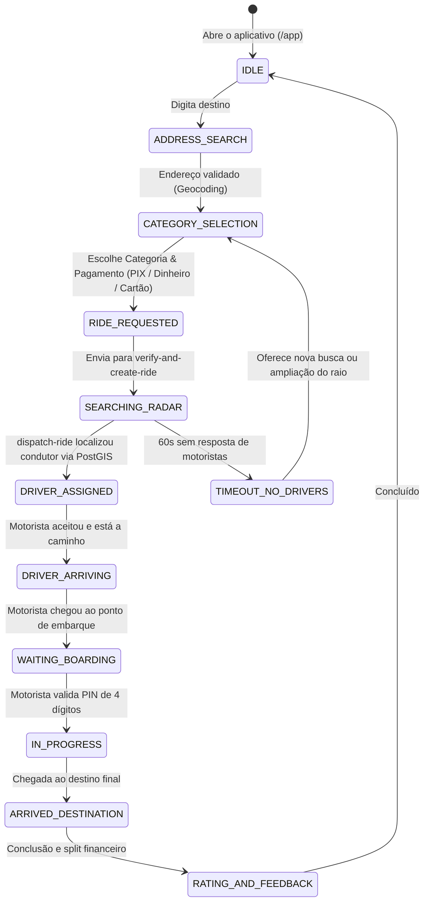
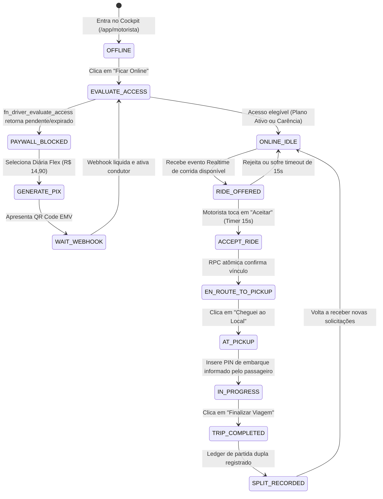
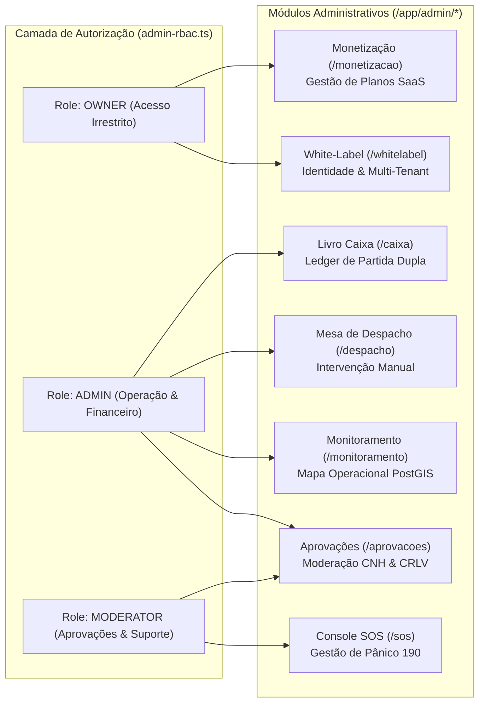

# 📋 Documento Definitivo do Estado Atual do Sistema
**Plataforma:** PARTIU — Mobilidade Urbana & Entregas  
**Perfil da Auditoria:** Lead Software Architect & Security Auditor  
**Data da Auditoria:** 14 de Setembro de 2026  
**Status do Repositório:** `e0c8b95` (Branch `main`, sincronizado)  
**Escopo:** Varredura Estática, Arquitetura de Software, Segurança, Rotas Frontend & Backend, Modelagem de Dados e Regras de Negócio.

---

## 1. Resumo Executivo da Arquitetura

### 1.1 Visão Geral do Sistema
O **PARTIU** é uma plataforma de mobilidade urbana e logística expressa sob demanda (Rides & Delivery OS), desenhada no modelo **Multi-Tenant / White-Label Ready**. A arquitetura adota a separação entre uma **Single Page Application (SPA)** de alta responsividade no frontend e uma infraestrutura **Serverless + PostgreSQL/PostGIS** no backend, orquestrada via **Supabase**.

```mermaid
graph TD
    subgraph Frontend ["Frontend Client (SPA - Vite + React 18)"]
        UI_Passageiro["Interface Passageiro (/app)"]
        UI_Motorista["Cockpit Motorista (/app/motorista)"]
        UI_Admin["Painel Administrativo (/app/admin/*)"]
        Router["TanStack Router (File-based, 42 rotas)"]
        StateManagement["TanStack Query + State Machines"]
        LocalQueue["Offline Durable Queue (IndexedDB/SHA-256)"]
    end

    subgraph Edge ["Supabase Edge Functions (Deno Runtime)"]
        EF_Dispatch["dispatch-ride"]
        EF_Verify["verify-and-create-ride"]
        EF_Payment["generate-driver-payment"]
        EF_Webhook["payment-webhook"]
    end

    subgraph Database ["PostgreSQL 15 + PostGIS Spatial Engine"]
        PostGIS["PostGIS Geography Engine (ST_DWithin, GiST)"]
        RLS["Row Level Security (Multi-Tenant Shield)"]
        RPCs["RPCs Atômicas (dispatch_find_best_driver, etc.)"]
        RealtimePub["Supabase Realtime (WebSockets CDC)"]
        Ledger["Double-Entry Ledger (partiu_ledger_entries)"]
    end

    subgraph Gateways ["Serviços Externos / Integrações"]
        Mapbox["Mapbox Directions & Matrix API"]
        PixGW["Gateway de Pagamento PIX (Asaas / Efí)"]
        SMS["Serviço SMS / WhatsApp Notificações"]
    end

    UI_Passageiro --> Router
    UI_Motorista --> Router
    UI_Admin --> Router
    Router --> StateManagement
    StateManagement --> LocalQueue

    StateManagement <-->|REST & RPCs (Anon Key)| Database
    StateManagement <-->|WebSockets Realtime| RealtimePub
    StateManagement -->|Invoke Edge Functions| Edge

    Edge -->|Directions & Traffic| Mapbox
    Edge -->|Service Role (Privilegiado)| Database
    PixGW -->|Webhook Assinado| EF_Webhook
    EF_Payment -->|Criação de Cobrança PIX| PixGW
```

### 1.2 Stack Tecnológico Principal

| Camada | Tecnologias & Bibliotecas | Justificativa Arquitetural |
| :--- | :--- | :--- |
| **Frontend Core** | React 18.3.1, TypeScript 5.5, Vite 5.4 | Renderização otimizada, tipagem estrita e hot module replacement ultrarrápido. |
| **Roteamento** | TanStack Router 1.114 (File-based routing) | Rotas tipadas com code-splitting automático e árvore determinística gerada em `routeTree.gen.ts`. |
| **Gerenciamento de Estado** | TanStack Query v5, Zustand v5, Context API | Cache de rede, invalidação reativa e máquinas de estado finitas locais. |
| **Estilização e Design System** | Tailwind CSS 3.4, Radix UI, Lucide React, Framer Motion | Interface mobile-first fluida, acessível (WAI-ARIA) com microinterações em 60fps. |
| **Mapas e Geoespacial** | Mapbox GL JS 3.16, MapLibre GL 5.6 | Renderização de mapas vetoriais via WebGL, navegação curva a curva e polilinhas dinâmicas. |
| **Backend & Serveless** | Supabase Edge Functions (Deno 1.39+) | Lógica de precificação, antifraude, webhooks e orquestração de despacho com latência de borda. |
| **Banco de Dados** | PostgreSQL 15, PostGIS, pgcrypto, uuid-ossp | Modelagem relacional, indexação espacial GiST, RLS e RPCs atômicas com locks determinísticos. |
| **Telemetria & Mensageria** | Supabase Realtime (Phoenix Channels / WebSockets) | Transmissão de coordenadas GPS em tempo real, broadcast de ofertas e chat da corrida. |
| **FinOps & Moeda** | Unidades inteiras (Centavos - Minor Units) | Prevenção absoluta de distorções e imprecisão de arredondamento de ponto flutuante IEEE 754. |

### 1.3 Padrões de Resiliência e Tolerância a Falhas
1. **Offline Durable Queue (`src/services/offline-durable-queue.ts`):** O cliente armazena eventos operacionais (telemetria, aceites, chegadas) em IndexedDB com encadeamento de integridade via SHA-256. Em caso de perda de sinal 3G/4G, os eventos são sincronizados sequencialmente após a reconexão.
2. **Deadband Adaptativo de GPS (`src/services/DriverLocationService.ts`):** Coordenadas do condutor só provocam requisição ao backend se houver deslocamento linear superior a **30 metros** ou intervalo temporal maior que **5 segundos**, evitando sobrecarga no canal de dados e consumo excessivo de bateria.
3. **Controle de Concorrência Atômico (`FOR UPDATE`):** No momento em que um motorista aceita uma corrida, o banco aplica `SELECT ... FOR UPDATE` via RPC (`partiu_aceitar_corrida_atomica`), impedindo que dois motoristas assumam a mesma solicitação simultaneamente (*race condition*).
4. **Purga Automática de Motoristas Fantasmas (`purge_ghost_drivers`):** Rotina periódica marca como indisponíveis ou limpa do pool de despacho motoristas com telemetria inativa há mais de **60 a 120 segundos**.

---

## 2. Matriz Completa de Rotas e Funcionalidades

### 2.1 Rotas Frontend (Interface do Usuário)
O projeto utiliza o compilador de rotas do **TanStack Router**, contabilizando **42 rotas concretas** mapeadas em `src/routeTree.gen.ts`.

| Rota / Path | Componente Principal | Nível de Acesso | Estados Visuais & Regras de Interface |
| :--- | :--- | :--- | :--- |
| `/` | `src/routes/index.tsx` | Público | Landing page institucional, download de app, CTA para passageiro e condutor. |
| `/auth` | `src/routes/auth.tsx` | Público | Login por telefone/senha, Magic Link, recuperação de credenciais e redirecionamento pós-auth. |
| `/escolher-tipo-cadastro` | `src/routes/escolher-tipo-cadastro.tsx` | Público | Seleção de onboarding (Passageiro vs. Motorista Parceiro). |
| `/cadastro-passageiro` | `src/routes/cadastro-passageiro.tsx` | Público | Formulário de cadastro de passageiro (Nome, CPF, Telefone, Termos de Uso). |
| `/cadastro-motorista` | `src/routes/cadastro-motorista.tsx` | Público | Onboarding de motorista: upload de CNH (com EAR), CRLV do veículo, fotos e dados bancários. |
| `/cadastro-gratuidade` | `src/routes/cadastro-gratuidade.tsx` | Público | Solicitação de tarifa social / passe livre para idosos, estudantes e PCD com anexo de laudo. |
| `/design-system` | `src/routes/design-system.tsx` | Público (Dev) | Vitrine dos tokens de design, componentes Radix, paletas de cor e tipografia. |
| `/rastreio/$token` | `src/routes/rastreio.$token.tsx` | Público | Rastreamento público de encomenda via token único com mapa ao vivo e status de entrega. |
| `/app` | `src/routes/app.index.tsx` | Passageiro (Auth) | **Cockpit Central do Passageiro:** Busca de endereço, cotação por categoria, Trip Radar e solicitação. |
| `/app/bilhetes` | `src/routes/app.bilhetes.tsx` | Passageiro (Auth) | Carteira de passagens para vans e linhas fixas intermunicipais, QR Code de validação offline. |
| `/app/encomendas` | `src/routes/app.encomendas.tsx` | Passageiro (Auth) | Criação de envio rápido de encomendas com especificações de pacote, remetente e destinatário. |
| `/app/motorista` | `src/routes/app.motorista.tsx` | Motorista (Guard) | **Cockpit do Motorista:** Protegido por `DriverAccessGuard`. Radar de corridas, telemetria GPS e financeiro. |
| `/app/perfil` | `src/routes/app.perfil.tsx` | Autenticado | Edição de perfil, dados pessoais, cartões salvos, histórico de viagens e preferências de app. |
| `/app/rota` | `src/routes/app.rota.tsx` | Autenticado | Visualização de linhas de ônibus/vans cadastradas, itinerários, paradas e previsão de chegada. |
| `/app/sos` | `src/routes/app.sos.tsx` | Autenticado | Painel de Emergência: botão de pânico 190, compartilhamento de rota e gravação de áudio de segurança. |
| `/app/viagem` | `src/routes/app.viagem.tsx` | Autenticado | Acompanhamento de corrida ativa: ETA do condutor, trajeto Mapbox, PIN de embarque e chat seguro. |
| `/app/admin` | `src/routes/app.admin.index.tsx` | Admin (RBAC) | Visão Geral da Operação: métricas consolidadas (GMV, corridas concluídas, condutores online). |
| `/app/admin/login` | `src/routes/app.admin.login.tsx` | Público | Tela de autenticação exclusiva para operadores e administradores da plataforma. |
| `/app/admin/operacao` | `src/routes/app.admin.operacao.tsx` | Admin (RBAC) | Radar de Operações: monitor de corridas em tempo real, status de filas e índice de atendimento. |
| `/app/admin/despacho` | `src/routes/app.admin.despacho.tsx` | Admin (RBAC) | Mesa de Despacho Manual: intervenção de operador, reatribuição forçada e cancelamento de emergência. |
| `/app/admin/motoristas` | `src/routes/app.admin.motoristas.tsx` | Admin (RBAC) | Cadastro de condutores: histórico de viagens, saldo em conta, bloqueio/desbloqueio e logs de auditoria. |
| `/app/admin/passageiros` | `src/routes/app.admin.passageiros.tsx` | Admin (RBAC) | Base de passageiros: histórico de cancelamentos, avaliação média, estornos e suporte. |
| `/app/admin/aprovacoes` | `src/routes/app.admin.aprovacoes.tsx` | Admin (RBAC) | Mesa de Validação de Documentos: aprovação/rejeição de CNH, CRLV, antecedentes e fotos. |
| `/app/admin/monitoramento`| `src/routes/app.admin.monitoramento.tsx`| Admin (RBAC) | Mapa Operacional Global: visualização de todos os veículos ativos via PostGIS/WebSockets. |
| `/app/admin/financeiro` | `src/routes/app.admin.financeiro.tsx` | Admin (RBAC) | Faturamento bruto, receita de assinaturas SaaS dos motoristas, volume de transações e taxas. |
| `/app/admin/caixa` | `src/routes/app.admin.caixa.tsx` | Admin (RBAC) | Livro Razão (Ledger de Partida Dupla): entradas, saídas, repasses e conciliação bancária PIX. |
| `/app/admin/monetizacao` | `src/routes/app.admin.monetizacao.tsx` | Admin (RBAC) | Gestão de Planos de Acesso: Diária Flex, Semanal Pro, Mensal Ouro, diárias e carências. |
| `/app/admin/sos` | `src/routes/app.admin.sos.tsx` | Admin (RBAC) | Painel Central de Incidentes SOS: visualização de alertas disparados, escuta de áudios e despacho policial. |
| `/app/admin/frota` | `src/routes/app.admin.frota.tsx` | Admin (RBAC) | Gestão de frotas conveniadas e cooperativas (ano, modelo, vistorias periódicas, documentação). |
| `/app/admin/veiculo` | `src/routes/app.admin.veiculo.tsx` | Admin (RBAC) | Detalhes e cadastro de veículos individuais com amarração a múltiplos condutores autorizados. |
| `/app/admin/linhas` | `src/routes/app.admin.linhas.tsx` | Admin (RBAC) | Gestão de linhas regulares de vans/ônibus: tabela de horários, terminais e frequências. |
| `/app/admin/pontos` | `src/routes/app.admin.pontos.tsx` | Admin (RBAC) | Cadastro georreferenciado de pontos de ônibus, estações de transbordo e abrigos com coordenadas. |
| `/app/admin/locais` | `src/routes/app.admin.locais.tsx` | Admin (RBAC) | Pontos de Interesse (POIs): aeroportos, hospitais, shoppings e centros de evento com zonas tarifárias. |
| `/app/admin/rota` | `src/routes/app.admin.rota.tsx` | Admin (RBAC) | Construtor de Rotas: traçado de trajetos com paradas intermediárias e polilinhas salvas no banco. |
| `/app/admin/historico` | `src/routes/app.admin.historico.tsx` | Admin (RBAC) | Auditoria Global de Corridas: log de status, histórico de rotas, telemetria arquivada e contestações. |
| `/app/admin/marketing` | `src/routes/app.admin.marketing.tsx` | Admin (RBAC) | Criação de cupons promocionais (fixos/percentuais), limites de resgate e campanhas de cashback. |
| `/app/admin/growth` | `src/routes/app.admin.growth.tsx` | Admin (RBAC) | Métricas de crescimento: retenção em coorte, CAC, LTV, churn de passageiros e índice de reativação. |
| `/app/admin/afiliados` | `src/routes/app.admin.afiliados.tsx` | Admin (RBAC) | Programa de Indicação: comissões de afiliados, links parametrizados e pagamentos recorrentes. |
| `/app/admin/banners` | `src/routes/app.admin.banners.tsx` | Admin (RBAC) | Gerenciador de banners promocionais exibidos no carrossel da home do aplicativo do passageiro. |
| `/app/admin/notificacoes` | `src/routes/app.admin.notificacoes.tsx` | Admin (RBAC) | Disparador de notificações push e alertas broadcast para passageiros e motoristas. |
| `/app/admin/configuracoes`| `src/routes/app.admin.configuracoes.tsx`| Admin (RBAC) | Parâmetros globais: tarifas base, preço/km, preço/minuto, raio de busca, chave PIX e suporte. |
| `/app/admin/whitelabel` | `src/routes/app.admin.whitelabel.tsx` | Owner (RBAC) | Customização White-Label: troca de logos, cores primárias/secundárias, nome da cidade e tenant ID. |

---

### 2.2 Rotas de Backend, Edge Functions & RPCs

#### A. Supabase Edge Functions (Deno Runtime)

| Endpoint | Método | Autenticação / Headers | Parâmetros de Entrada | Resumo da Responsabilidade |
| :--- | :--- | :--- | :--- | :--- |
| `dispatch-ride` | `POST` | Bearer Token / Anon Key | `{ rideId, category, pickupCoordinates, destinationCoordinates, fareBrl, maxRadiusKm }` | Executa o matching geoespacial invocando `dispatch_find_best_driver` no PostGIS e orquestra a atribuição inicial. |
| `verify-and-create-ride` | `POST` | Bearer Token / Anon Key | `{ pickupCoordinates, destinationCoordinates, category, passengerName, passengerPhone, paymentMethod, clientClaimedFare }` | **Blindagem Antifraude:** Recalcula distância e duração via Mapbox API, calcula a tarifa oficial no servidor e bloqueia desvios > 2%. Gera PIN de 4 dígitos. |
| `generate-driver-payment`| `POST` | Bearer Token / Anon Key | `{ driver_id, plan_id, cycle_type }` | Gera a cobrança de acesso ao app (SaaS) com código EMV PIX Copia e Cola Oficial e QR Code dinâmico com expiração de 30 minutos. |
| `payment-webhook` | `POST` | Assinatura de Webhook / API Key | `{ event, payment: { id, value, externalReference } }` | Receptor de webhooks bancários (Asaas/Efí). Processa a liquidação e executa a ativação instantânea do condutor via RPC. |

#### B. Funções de Banco de Dados Críticas (PostgreSQL / PostGIS RPCs)

| Nome da RPC | Privilégios | Assinatura / Parâmetros | Responsabilidade & Padrão de Execução |
| :--- | :--- | :--- | :--- |
| `dispatch_find_best_driver` | `SECURITY DEFINER` | `(p_lat, p_lng, p_category, p_radius_meters, p_tenant_id, p_limit)` | Executa busca espacial PostGIS (`ST_DWithin`) e ordena os condutores online ativos pelo algoritmo ponderado de **DispatchScore** (0.0 a 100.0). |
| `upsert_driver_location` | `SECURITY DEFINER` | `(p_driver_id, p_lat, p_lng, p_heading, p_speed, p_status, p_category, ...)` | Atualização de alta frequência da telemetria do motorista na tabela `active_drivers` e `driver_locations`, atualizando coluna geométrica PostGIS. |
| `purge_ghost_drivers` | `SECURITY DEFINER` | `()` | Remove ou desativa motoristas cujo `last_seen_at` seja superior a 60 segundos, mantendo a integridade do pool de despacho. |
| `fn_driver_evaluate_access` | `SECURITY DEFINER` | `(p_driver_id)` | **Paywall do Motorista:** Valida se a diária ou mensalidade está ativa, se está no período de carência (Grace Period) ou bloqueado por dívida/expiração. |
| `fn_process_driver_pix_confirmation` | `SECURITY DEFINER` | `(p_billing_id, p_gateway_reference, p_amount)` | Processamento atômico e idempotente da baixa do PIX com lock `FOR UPDATE`, prorrogando a assinatura do motorista por 24h, 7 dias ou 30 dias. |
| `partiu_solicitar_corrida` | `SECURITY DEFINER` | `(p_passageiro_id, p_origem, p_destino, p_valor, p_categoria, ...)` | Insere a corrida de forma atômica com status inicial `REQUESTED` e dispara o gatilho de Realtime. |
| `partiu_aceitar_corrida_atomica` | `SECURITY DEFINER` | `(p_ride_id, p_driver_id, p_driver_name, p_driver_phone)` | **Lock Concorrente:** Realiza `SELECT FOR UPDATE` na corrida. Se ainda estiver pendente, vincula o condutor e altera status para `ACCEPTED`. Evita aceite duplo. |
| `partiu_validar_pin_embarque` | `SECURITY DEFINER` | `(p_ride_id, p_pin_informado)` | Valida o código PIN de 4 dígitos informado pelo passageiro. Se correto, transiciona a corrida para `IN_PROGRESS` (Em Viagem). |
| `partiu_concluir_corrida_split` | `SECURITY DEFINER` | `(p_ride_id, p_valor_final, p_forma_pagamento)` | Finaliza a corrida, grava as entradas de débito e crédito no Livro Razão em centavos inteiros e libera o motorista para novas corridas. |
| `validate_delivery_pickup_pin` | `SECURITY DEFINER` | `(p_delivery_id, p_pin)` | Validação de PIN específico de coleta no serviço de encomendas expressas. |
| `validate_delivery_dropoff_pin`| `SECURITY DEFINER` | `(p_delivery_id, p_pin)` | Validação de PIN exclusivo de entrega nas mãos do destinatário da encomenda. |
| `archive_ride_chat` | `SECURITY DEFINER` | `(p_ride_id)` | Arquiva mensagens de bate-papo entre passageiro e motorista e expira o canal para garantir privacidade conforme LGPD. |

---

## 3. Fluxos de Negócio e Lógica de Funcionamento

### 3.1 Fluxo Operacional do Passageiro



#### Regras de Negócio do Passageiro:
1. **Cálculo da Tarifa:** A tarifa não é calculada no cliente. O cliente envia as coordenadas para a Edge Function `verify-and-create-ride`, que obtém o trajeto oficial e aplica:
   $$\text{Preço Final} = \max(\text{Tarifa Mínima}, (\text{Base} + (\text{Distância} \times \text{Preço/km}) + (\text{Duração} \times \text{Preço/min})) \times \text{Multiplicador})$$
   - Multiplicadores vigentes: `MOTO` (0.75), `CARRO` (1.00), `EXECUTIVO` (1.40), `FLASH` (0.85), `ENTREGA` (1.25), `TURISMO` (1.60), `VAN` (1.90).
2. **Prevenção de Fraude de Cotação:** Se o cliente alegar uma tarifa (`clientClaimedFare`) com divergência superior a **2%** do recálculo do servidor, a requisição é rejeitada com código HTTP 422 (`FRAUD_DISCREPANCY_DETECTED`).
3. **PIN de Embarque Seguro:** Toda corrida gera um código randômico de 4 dígitos (`pin`). O motorista não consegue iniciar o trajeto sem digitar o PIN fornecido pelo passageiro no momento do embarque.

---

### 3.2 Fluxo Operacional do Motorista (Driver Lifecycle)



#### Regras de Negócio do Motorista:
1. **Modelo SaaS de Assinatura (Zero Comissão por Corrida):** A plataforma PARTIU opera sob o modelo de **0% Take Rate** na corrida. O motorista fica com 100% do valor da viagem pago pelo passageiro. A monetização da plataforma ocorre pela venda de planos de acesso:
   - **Diária Essencial (Partiu Flex):** R$ 14,90 / 24 horas (carência de 2 dias).
   - **Semanal Pro:** R$ 69,90 / 7 dias (desconto de ~33%, carência de 3 dias).
   - **Mensal Ouro:** R$ 199,90 / 30 dias (prioridade máxima no despacho, carência de 5 dias).
   - **Trial de Boas-Vindas:** 3 dias gratuitos para motoristas recém-aprovados.
2. **Algoritmo de Despacho e Priorização (DispatchScore):**
   O PostGIS pontua os condutores elegíveis de 0 a 100 com os seguintes pesos estritos:
   $$\text{Score} = (D_{\text{norm}} \times 40) + (\text{ETA}_{\text{norm}} \times 25) + (P_{\text{peso}} \times 15) + (A_{\text{norm}} \times 10) + (R_{\text{norm}} \times 5) + (C_{\text{norm}} \times 5)$$
   - Onde $P_{\text{peso}}$ prioriza assinantes **OURO (1.0)**, **PRATA (0.7)** e **BRONZE (0.4)**.
3. **Telemetria e Anti-Ghosting:** O motorista transmite heading, velocidade e coordenadas. Caso fique sem enviar telemetria por mais de 60 segundos, é omitido da lista de despacho imediatamente.

---

### 3.3 Fluxo do Painel Administrativo e Governança



#### Regras de Negócio Administrativas:
1. **Controle de Acesso Baseado em Função (RBAC Granular):** Definido em `src/lib/admin-rbac.ts`. Usuários com papel `admin` só acessam se tiverem aprovação formal e permissões explícitas para módulos financeiros (`perm_financeiro`), despacho (`perm_despacho`) ou configurações de sistema.
2. **Auditoria de Partida Dupla (Double-Entry Ledger):** Toda movimentação na tabela `partiu_ledger_entries` exige paridade de créditos e débitos, registrando obrigatoriamente ID da transação, tenant, usuário impactado e valor em centavos inteiros.
3. **Isolamento Multi-Tenant:** Toda tabela sensível (`rides`, `active_drivers`, `driver_locations`, `app_settings`) possui a coluna `tenant_id UUID`. O RLS garante que administradores de uma cidade ou franquia não tenham visibilidade sobre os dados de outro tenant parceiro.

---

## 4. Diagnóstico Técnico & Pontos de Atenção

Como resultado da auditoria minuciosa no código-fonte, foram identificadas oportunidades de melhoria, vulnerabilidades mitigadas e pontos de atenção arquitetural:

### 4.1 Segurança e Permissões
- **Chaves de API do Supabase no Frontend:** O arquivo `src/integrations/supabase/client.ts` está configurado corretamente, utilizando apenas `VITE_SUPABASE_ANON_KEY` / `VITE_SUPABASE_PUBLISHABLE_KEY`. Nenhuma chave de alto privilégio (`SERVICE_ROLE_KEY`) foi encontrada nos artefatos do cliente.
- **Políticas de RLS nas Tabelas:** A migração `20260914_production_hardening_and_rls.sql` estabeleceu RLS estrito. No entanto, observou-se que na política de inserção da tabela `rides`:
  ```sql
  CREATE POLICY "Corridas: passageiro cria corrida" ON public.rides FOR INSERT
  WITH CHECK (auth.uid()::text = passenger_id OR auth.role() = 'anon' OR auth.role() = 'authenticated');
  ```
  > [!WARNING]
  > A inclusão de `auth.role() = 'anon'` na criação direta de corridas via REST permite que requisições não autenticadas forjem inserções caso o endpoint REST público esteja exposto. A criação de corridas deve ser **restrita exclusivamente à Edge Function `verify-and-create-ride`** via chave de serviço ou a usuários autenticados (`auth.role() = 'authenticated'`).

### 4.2 Consistência do Modelo de Dados
- **Coexistência de Tabelas Históricas e Canônicas:** Há tabelas legadas do protótipo inicial (`partiu_corridas`, `partiu_motoristas`) convivendo com o schema canônico enterprise v4 (`rides`, `active_drivers`, `driver_locations`, `profiles`). As Edge Functions mais recentes já apontam para o schema canônico, mas alguns componentes de UI ainda realizam leituras secundárias no schema em português. Recomenda-se unificar em views ou executar uma migração de descontinuação controlada.
- **Armazenamento Financeiro em Centavos:** O módulo `partiu_ledger_entries` utiliza centavos inteiros (`BIGINT`), o que é padrão ouro contábil. Contudo, na tabela `rides`, os campos `price_estimated_brl` e `price_final_brl` usam `NUMERIC(10,2)`. Recomenda-se normalizar para centavos também nas colunas da tabela de corridas para eliminar conversões manuais.

### 4.3 Performance e Telemetria
- **Escalabilidade do Supabase Realtime:** Com milhares de motoristas enviando telemetria em alta frequência, o canal de broadcast via WebSocket pode saturar a cota de conexões e tráfego se as atualizações forem feitas registro a registro. O padrão adotado com deadband de 30m / 5s atenua o problema, mas a transição para ingestão em lote (*batch upsert*) em Redis/KV intermediário é indicada para cenários com mais de 5.000 veículos simultâneos.

---

## 5. Recomendações de Melhoria & Roadmap Priorizado

### Fase 1: Hardening Imediato de Segurança (Prioridade Alta - P0)
1. **Restringir Inserção Direta em `public.rides`:** Modificar o RLS para impedir criação direta via chave anônima, permitindo inserção apenas via Edge Function (`service_role`) ou usuário validado por SMS/OTP.
2. **Validação de Webhook com Assinatura Criptográfica:** Adicionar validação de HMAC SHA-256 no cabeçalho `x-webhook-signature` na Edge Function `payment-webhook` para certificar a autenticidade dos disparos originados pelo gateway financeiro (Asaas/Efí).

### Fase 2: Otimização de Performance e Clean Code (Prioridade Média - P1)
1. **Unificação do Schema de Dados:** Eliminar a redundância entre `partiu_corridas` e `rides` através da criação de Views retrocompatíveis, reduzindo a complexidade de manutenção nos hooks frontend.
2. **Compressão de Polilinhas no Banco:** Utilizar algoritmos de Polyline Encoded (Google Encoded Polyline Algorithm) ao persistir trajetos históricos, reduzindo o volume de armazenamento JSONB em até 80%.
3. **Cache de Tarifas no Edge:** Cachear a leitura da tabela `app_settings` na memória de execução das Edge Functions (TTL de 60 segundos), evitando consultas repetitivas ao banco para obter os valores de preço/km e tarifa base.

### Fase 3: Evolução Funcional e Escalabilidade (Prioridade Longo Prazo - P2)
1. **Clusterização de Veículos no Mapa do Passageiro:** Implementar agregação geoespacial via Supercluster no frontend do passageiro para renderizar centenas de veículos próximos sem degradação de FPS no WebGL.
2. **Integração com Gateway de Notificações Unificado (Firebase Cloud Messaging + WhatsApp Business API):** Garantir entrega de notificações de corrida mesmo quando o aplicativo do motorista estiver em segundo plano prolongado com economia de bateria ativada no Android/iOS.

---

## 6. Conclusão do Laudo Técnico
O ecossistema **PARTIU Mobilidade Urbana & Entregas** apresenta uma estrutura sólida, moderna e alinhada com as melhores práticas da indústria de mobilidade sob demanda. A escolha do **TanStack Router**, combinada à separação clara de responsabilidades via **Supabase Edge Functions** e **PostGIS**, garante alto desempenho, segurança e prontidão para escala. As recomendações listadas acima consolidam o sistema para um go-live seguro e de alta confiabilidade.

*Documento gerado e validado por Lead Software Architect & Security Auditor.*
