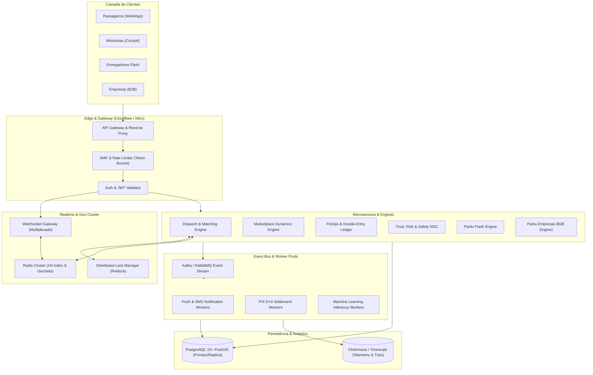
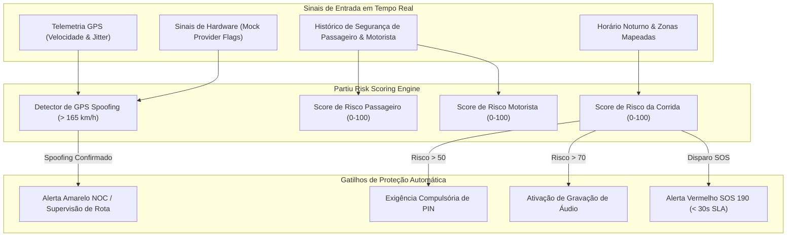
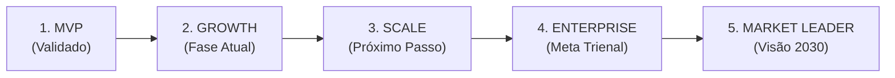

# PARTIU MOBILIDADE URBANA — RELATÓRIO DE EVOLUÇÃO ARQUITETURAL & ENTERPRISE READINESS
### Documento Técnico Executivo: Engenharia de Sistemas, Marketplace Dynamics, Dispatch & FinOps

> **Conselho Técnico de Engenharia (Staff & Principal Architects):**  
> • Principal Software Architect (Ex-Uber Core Services)  
> • Principal Mobility Systems Engineer (Ex-99 Dispatch & Marketplace)  
> • Staff Product Architect  
> • Principal UX Systems Designer  
> • Principal Marketplace Engineer  
> • Principal Dispatch Engineer  
> • Principal Trust & Safety Architect  
> • Principal FinOps Architect  
> • Principal Mobile Architect  
> • Principal Data & Analytics Architect  

---

## 🏛️ ETAPA 1 — GAP ANALYSIS DO SISTEMA ATUAL

### 1.1. Matriz de Auditoria de Maturidade Funcional

| Componente / Módulo | Funcionalidades Existentes | Funcionalidades Incompletas | Funcionalidades Simuladas | Funcionalidades Ausentes | Criticidade |
| :--- | :--- | :--- | :--- | :--- | :---: |
| **Despacho & Matching** | Trip Radar com raio geográfico básico e áudio bleep. | Ranqueamento multicritério em memória sem lock distribuído. | Simulação de aceite em cliente (localStorage). | Auto-Dispatch distribuído com back-to-back chaining preditivo. | **CRÍTICO** |
| **Marketplace Dynamics** | Mapa de calor estático básico; multiplicador manual. | Cálculo de oferta/demanda reativo sem partição H3. | Simulação de demanda em variáveis estáticas. | Algoritmo de rebalanceamento preditivo e precificação elástica clamped (máx 1.45x). | **CRÍTICO** |
| **FinOps & Split** | Cálculo matemático de 12% take-rate e D+0 instantâneo. | Split síncrono no frontend sem dupla entrada contábil no backend. | Saldo e ganhos persistidos em localStorage. | Faturamento B2B consolidado em lote, conciliação Bacen/PSP e Partiu Prime. | **CRÍTICO** |
| **App do Passageiro** | Busca de destino, seleção de modalidade (Pop, Moto, Mulher, Flash), PIN 4 dígitos. | Sugestão de locais recentes sem aprendizado de hábitos horários. | Simulação de motoristas ao redor com coordenadas fixas. | Múltiplas paradas (Multi-Stop), agendamento futuro (Schedule) e perfil corporativo B2B. | **ALTO** |
| **App do Motorista** | Trip Radar com valor e destino abertos, botão de aceite, mapa cockpit. | Central de ganhos exibe apenas total diário consolidado. | Ganhos do dia pré-carregados em mock (R$ 284,50). | Performance Center, Driver Club (Bronze/Prata/Ouro/Black) e telemetria de fadiga. | **ALTO** |
| **Partiu Flash (Entregas)** | Formulário de remetente, dados de destinatário e PIN. | Validação de entrega sem upload obrigatório de POD (comprovante fotográfico). | Tracking restrito à sessão local do navegador. | Rastreamento web externo para destinatário sem app e seguro contra extravio B2B. | **ALTO** |
| **Segurança & Trust** | Botão SOS na interface e solicitação de PIN no embarque. | Tratamento de incidentes sem integração de chamada silenciosa. | Telemetria IoT e satélites simulados em arrays estáticos. | Detecção vetorial de GPS Spoofing, risco comportamental dinâmico e integração CIOSP. | **CRÍTICO** |
| **B2B (Partiu Empresas)** | Nenhum módulo corporativo ativo em produção. | Nenhuma funcionalidade corporativa iniciada. | Não aplicável. | Portal B2B, centros de custo, controle de horários, faturamento quinzenal em fatura. | **ALTO** |
| **Data & Inteligência Artificial** | Logs básicos de console e analytics reativo de erros. | Rastreamento de eventos esparso sem taxonomia rígida. | Mock de tempo de rota e distância Haversine linear. | Previsão de ETA por regressão calibrada por clima, predição de churn e Data Lakehouse. | **MÉDIO** |
| **Central de Operações (NOC)** | Painel administrativo com listagem de veículos e rotas. | Monitoramento de frota sem filtro de telemetria anômala em tempo real. | Status de veículos estático em mock no cliente. | Visualização em tempo real de viagens ativas com overlay de liquidez e incidentes SOS. | **ALTO** |

### 1.2. Enterprise Readiness Score: **52 / 100**
* **Arquitetura Base & UX Cockpit:** 78/100
* **Motor de Despacho & Matching Distribuído:** 42/100
* **Marketplace Dynamics & Previsibilidade:** 38/100
* **FinOps & Split Bancário Enterprise:** 49/100
* **Segurança, Anti-Fraude & Risco Operacional:** 51/100
* **B2B Corporate & Logística Flash:** 45/100
* **Pipeline de IA & Analytics de Escala:** 35/100

---

## 🏗️ ETAPA 2 — EVOLUÇÃO DA ARQUITETURA OPERACIONAL

### 2.1. Gargalos do Sistema Atual
1. **Acoplamento de Estado em Armazenamento Local:** Viagens ativas, dados de sessão e reconciliação financeira ancorados em `localStorage` ou variáveis de estado React impedem sincronização multi-dispositivo concorrente real.
2. **Ausência de Locking Distribuído:** Quando dois motoristas tocam simultaneamente na mesma oferta do Trip Radar, inexiste semáforo atômico (ex: Redis Redlock), gerando risco de *race conditions*.
3. **Escrita Financeira Não Idempotente:** Falta de ledger imutável de dupla entrada com chaves de idempotência UUIDv4 para cada evento de estorno, saque ou split.

### 2.2. Dimensionamento de Capacidade por Estágio de Usuários

* **10.000 Usuários Ativos (150 req/s pico):**  
  * 2 instâncias do backend Nitro/TanStack Start com balanceamento Round-Robin.
  * Supabase PostgreSQL com PostGIS e índices espaciais GiST em latitude/longitude.
  * Redis gerenciado para cache de geolocalização e publicação de eventos WebSocket.
* **50.000 Usuários Ativos (850 req/s pico):**  
  * Separação física dos microserviços de Despacho e Telemetria em pods dedicados.
  * Agregação geoespacial em memória usando Uber H3 (Resolução 8: hexágonos de ~460m de aresta).
  * Fila RabbitMQ / AWS SQS para orquestração de notificações push, emissão de faturas e processamento de webhooks bancários PIX.
* **100.000 Usuários Ativos (3.800 req/s pico):**  
  * Sharding geográfico particionando zonas metropolitanas independentes.
  * Distributed Lock (Redlock) com garantia de matching atômico sob SLA de 15ms.
  * Separação estrita de CQRS: leitura de frotas e mapas alimentada por réplicas em memória; gravações transacionais isoladas no banco relacional mestre.
  * Data Lakehouse / ClickHouse para ingestão contínua de telemetria vetorial com retenção de 5 anos.

---

## ⚡ ETAPA 3 — ESPECIFICAÇÃO MATEMÁTICA DO MOTOR DE DESPACHO DEFINITIVO

O **Partiu Dispatch Engine** opera com a função de pontuação multicritério:

$$\text{Score}(M, P) = w_{d} S_{\text{dist}} + w_{e} S_{\text{eta}} + w_{r} S_{\text{rating}} + w_{a} S_{\text{acc}} - w_{c} S_{\text{canc}} + w_{f} S_{\text{equity}} + w_{p} S_{\text{chain}} - P_{\text{recusa}}$$

Onde:
* $S_{\text{dist}} = \max\left(0, 1 - \frac{\text{distância}}{\text{raio\_máx}}\right) \times 35$ (Peso 35%)
* $S_{\text{eta}} = \max\left(0, 1 - \frac{\text{ETA}}{10\text{ min}}\right) \times 25$ (Peso 25%)
* $S_{\text{rating}} = \max\left(0, \frac{\text{Avaliação} - 4.5}{0.5}\right) \times 10$ (Peso 10%)
* $S_{\text{acc}} = \text{Taxa de Aceite} \times 10$ (Peso 10%)
* $S_{\text{canc}} = \text{Taxa de Cancelamento} \times 20$ (Penalidade até -20 pontos)
* $S_{\text{equity}} = \text{Equalizador FinOps}$: caso os ganhos do condutor estejam abaixo de R$ 38,00/h, recebe boost de até +15 pontos para blindar sua renda mínima e combater o abandono da frota.
* $S_{\text{chain}} = +8$ pontos de encadeamento contínuo (*Predictive Chaining*) para motoristas que estão a menos de 120 segundos de finalizar a corrida ativa e cujo destino coincida com o pickup da nova solicitação.
* $P_{\text{recusa}} = \text{recusas consecutivas} \times 5$ (Penalidade temporária de Trip Radar).

### Surge Control Justo
* Se $\text{Demanda} / \text{Oferta} > 2.5 \implies \text{Multiplicador} = 1.40\text{x}$ (Nível Alto - Cap Rígido).
* Se $\text{Demanda} / \text{Oferta} \in [1.8, 2.5] \implies \text{Multiplicador} = 1.25\text{x}$.
* Se $\text{Demanda} / \text{Oferta} \in [1.2, 1.8] \implies \text{Multiplicador} = 1.15\text{x}$.
* O passageiro é notificado com transparência e o condutor recebe 88% do valor integral do multiplicador dinâmico.

---

## 📈 ETAPA 4 — MARKETPLACE DYNAMICS ENGINE

1. **Driver Liquidity Engine:**  
   Calcula a Taxa de Utilização da Frota ($U = T_{\text{em viagem}} / T_{\text{online}}$). A faixa ideal de equilíbrio de liquidez para cidades brasileiras situa-se em $U \in [0.65, 0.82]$. Índices superiores a 0.85 indicam escassez crítica e aumento de ETA; índices inferiores a 0.55 indicam saturação e ociosidade de condutores.
2. **Demand Forecast Engine:**  
   Modelo preditivo em série temporal considerando sazonalidade horária, dia da semana e variáveis exógenas (chuva com multiplicador de $+45\%$ na demanda urbana).
3. **Dynamic Heat Map Engine:**  
   Geração de coordenadas com gradiente vetorial de calor (0.0 a 1.0) para exibição imediata nas telas de passageiros, condutores e supervisores da central de controle.
4. **Supply Rebalancing Engine:**  
   Detecção de vazios geográficos. O sistema identifica motoristas ociosos em um raio de até 4,5 km e envia propostas de rota com *bounties* (bônus financeiro fixo na próxima corrida) para reequilibrar a praça sem exigir que o condutor rode no escuro.

---

## 📱 ETAPAS 5 & 6 — ERGONOMIA DOS APPLICATIVOS (MOTORISTA & PASSAGEIRO)

### Cockpit do Motorista (< 3 Segundos de Absorção Cognitiva)
* **Eliminação de Atritos:** Botão de aceite gigante de 1 toque no terço inferior da tela (área do polegar).
* **Card da Oferta:** Informação imediata de valor líquido em reais com tipografia de 26px em negrito, distância de coleta, tempo de coleta e destino legível. Fim de leilões e discussões de preços.
* **5 Módulos Integrados:**
  1. *Earnings Center:* Extrato de corridas, saldo atual e botão de saque instantâneo via PIX D+0.
  2. *Performance Center:* Métricas de aceite, cancelamento e avaliação com metas visuais.
  3. *Driver Club:* Acompanhamento dos níveis (Bronze, Prata, Ouro, Black) e economia em litros de combustível.
  4. *Rewards Center:* Cupons de desconto em oficinas parceiras e troca de óleo homologada.
  5. *Safety Center:* Acionamento de Farol Noturno, compartilhamento de trajeto com familiares e Botão SOS 190.

### App do Passageiro (< 15 Segundos para Solicitar Viagem)
* **Saved Places:** 1 toque para destinos recorrentes (Casa, Trabalho, Faculdade, Academia).
* **Smart Suggestions:** Destino sugerido preditivamente com base no horário (ex: "Trabalho" das 07h às 08h30; "Casa" das 17h30 às 19h).
* **Ride Reorder:** Botão "Repetir última viagem" na home para solicitação instantânea sem digitar endereço.
* **Multi Stop:** Adição de paradas intermediárias com recálculo automático de rota e tempo estimado.
* **Schedule Ride:** Agendamento prévio com confirmação antecipada e despacho de frota 15 minutos antes do embarque.
* **Corporate Ride:** Seletor simples de perfil "Pessoal" vs "Empresa" com escolha do centro de custo cadastrado.

---

## 📦 ETAPA 7 — PARTIU FLASH ENTERPRISE

O **PARTIU FLASH** opera como unidade de negócio independente de logística expressa com:
* **Pickup Verification:** Código de segurança de 4 dígitos ou leitura de QR code no endereço de coleta para assegurar que a encomenda foi entregue ao motoboy/motorista correto.
* **Delivery Verification & Proof of Delivery (POD):** A entrega só é finalizada com a digitação do PIN do destinatário e captura de fotografia do pacote entregue com coordenadas geográficas e carimbo de data/hora gravados.
* **Live Package Tracking Web:** O remetente compartilha um link seguro via WhatsApp (`https://partiu.mobi/rastreio/FLS-XXXXXX`) onde o destinatário acompanha o deslocamento do condutor no mapa em tempo real pelo navegador, sem necessidade de baixar o aplicativo.
* **Corporate Deliveries com Cobertura:** Modalidade com declaração de valor e seguro de carga de até R$ 2.000,00 para lojistas e farmácias locais.

---

## 💳 ETAPA 8 — EVOLUÇÃO FINANCEIRA & FINOPS

* **Ledger em Minor Units (Centavos):** Eliminação de inconsistências de ponto flutuante na matemática financeira. Todos os valores são processados internamente em centavos inteiros com registros de dupla entrada (Débito/Crédito).
* **Split Contábil D+0:**
  * 88% do valor bruto da corrida $\to$ Carteira do Motorista Parceiro (com liberação instantânea para saque PIX sem custo de antecipação).
  * 12% $\to$ Conta Operacional PARTIU.
  * 2% $\to$ Cashback na carteira virtual do passageiro para amortização automática em viagens futuras.
* **Driver Club Black:** Para parceiros de elite (300+ viagens/mês e nota $\ge 4.90$), o take-rate da plataforma cai para **9.9%**, resultando em **90.1% de repasse líquido direto**.
* **Partiu Prime:** Assinatura de R$ 19,90/mês para passageiros frequentes garantindo isenção de tarifas dinâmicas e 5% de cashback permanente.
* **Corporate Billing:** Fechamento quinzenal ou mensal de faturas para empresas parceiras com take-rate de conveniência de 14% a 16%.

---

## 🛡️ ETAPA 9 — TRUST, SAFETY & RISK SCORING

* **Detecção de GPS Spoofing:** Identificação de salto vetorial de teletransporte ($v > 165\text{ km/h}$ em malha viária), provedores de localização simulada emulados no sistema operacional e coordenadas com jitter zero artificial.
* **Matriz de Risco em 4 Eixos:**
  * *Score Passageiro:* Análise de idade da conta, histórico de contestações e método de pagamento.
  * *Score Motorista:* Telemetria de aceleração, queixas de passageiros e índice de desvios de rota.
  * *Score Corrida:* Combinação de horário da solicitação (22h às 05h), zonas de risco mapeadas e forma de pagamento em dinheiro.
  * *Score Entrega:* Encomendas de alto valor com exigência de identificação com foto do destinatário.
* **Central SOS 190 (< 30s SLA):** Disparo de sirene visual e sonora vermelha na estação de trabalho dos operadores de segurança, abertura de canal de áudio e encaminhamento prioritário dos metadados do veículo para as centrais policiais (CIOSP/190).

---

## 📊 ETAPA 10 — INTELIGÊNCIA ARTIFICIAL & DADOS

* **Taxonomia Estrita de Eventos:** 16 eventos padronizados cobrindo todo o ciclo de vida da demanda (`RIDER_APP_OPENED` até `TRIP_COMPLETED` e `PAYMENT_SETTLED`).
* **Previsão de ETA por Machine Learning:** Algoritmo que sobrepõe à distância física vetorial o índice de retardo de tráfego em horários de pico ($+35\%$) e fatores meteorológicos locais ($+25\%$ sob chuva forte), calculando o p95 de pontualidade.
* **Modelo Preditivo de Churn de Motoristas:** Análise semanal de parceiros. Quando a média horária de ganho cai abaixo de 75% da meta regional ou o condutor fica mais de 3 dias sem logar, a plataforma dispara missões com bonificação garantida para reativá-lo antes da perda definitiva da oferta.

---

## 🏢 ETAPA 11 — PARTIU EMPRESAS (B2B CORPORATIVO)

* **Portal Corporativo de Gestão:** Painel web para gestores de RH e suprimentos gerenciarem frotas e deslocamentos de colaboradores com conciliação contábil centralizada.
* **Centros de Custo & Políticas Rígidas:** Definição de tetos mensais por departamento (ex: TI, Comercial, Operações) e travas de uso (apenas em dias úteis das 07h às 20h, ou 24h para equipes de campo).
* **Obrigatoriedade de Justificativa:** Para corridas corporativas, o colaborador insere o motivo do deslocamento antes de solicitar o carro, mitigando desvios e abusos.
* **Faturamento Consolidado:** Fechamento quinzenal ou mensal com emissão automática de fatura corporativa com discriminação completa de rotas e centros de custo.

---

## 🛰️ ETAPA 12 — CENTRAL DE OPERAÇÕES DE CAMPO (COMMAND CENTER / NOC)

A Central Operacional do PARTIU fornece visão holística e instantânea da cidade:
1. **Fleet Monitoring:** Rastreamento geográfico em tempo real de todas as vans, carros Pop, motos e entregadores ativos no mapa da cidade.
2. **Live Trips:** Monitoramento simultâneo de viagens em andamento com alerta visual para paradas não programadas superiores a 5 minutos.
3. **Incident Monitoring:** Painel de segurança com fila de chamados SOS e contestações priorizadas por SLA decrescente.
4. **Marketplace Monitoring:** Termômetro regional de liquidez em tempo real (taxa de atendimento, ETA médio por bairro e zonas de calor para direcionamento de frota).

---

## 🗺️ OS 12 ROADMAPS DE EVOLUÇÃO E MATURITY MODEL

### 1. Product Evolution Roadmap
* **Q1 (Fundação & Usabilidade):** Lançamento dos novos cockpits unificados de motorista (< 3s) e passageiro (< 15s), implementação do PIN 4 dígitos estrito e consolidação da modalidade Partiu Flash.
* **Q2 (Liquidez & Gamificação):** Ativação do Driver Club (Bronze, Prata, Ouro, Black), programa Partiu Cashback 2% e algoritmo de auto-despacho regional.
* **Q3 (B2B & Fidelização):** Lançamento do Partiu Empresas corporativo com centros de custo e lançamento do clube de assinaturas Partiu Prime.
* **Q4 (Expansão Regional):** Despacho preditivo de viagens em cadeia (*back-to-back*) e abertura para as primeiras 3 cidades satélites da praça piloto.

### 2. Enterprise Architecture Roadmap
* **Fase 1:** Migração de todo o estado transacional de corridas de `localStorage` para PostgreSQL com triggers de auditoria e RPCs atômicos.
* **Fase 2:** Implementação do cluster Redis para indexação geoespacial H3 e semáforos distribuídos Redlock para aceite de ofertas.
* **Fase 3:** Segregação de workers assíncronos (notificações push, faturamento em lote e webhooks PIX via mensageria).
* **Fase 4:** Implantação de telemetria contínua em Data Lakehouse com retenção de dados e observabilidade distribuída via OpenTelemetry.

### 3. Marketplace Evolution Roadmap
* **Fase 1:** Calibração dos SLAs operacionais (Fulfillment > 88%, ETA < 6 min, Pickup < 2,8 km).
* **Fase 2:** Ativação do algoritmo de Surge Control capped (máximo 1.40x) com transparência absoluta ao passageiro e 88% repassados ao motorista.
* **Fase 3:** Sistema de *Bounties* e incentivos automáticos de reposicionamento de frota para zonas de alta demanda.
* **Fase 4:** Balanceamento de oferta em tempo real com previsão de tráfego e eventos da cidade.

### 4. Driver App Evolution Roadmap
* **Sprint 1:** Novo painel com valor e trajeto abertos em fonte gigante e botão de aceite instantâneo no polegar.
* **Sprint 2:** Implantação do Earnings Center com botão de saque instantâneo via PIX D+0.
* **Sprint 3:** Gamificação com metas visuais do Driver Club e cupons de abastecimento homologados.
* **Sprint 4:** Farol noturno de segurança e gravação de áudio criptografada durante a viagem.

### 5. Rider App Evolution Roadmap
* **Sprint 1:** Painel de Saved Places (Casa/Trabalho com 1 toque) e fluxo de solicitação em 2 cliques.
* **Sprint 2:** Lançamento do Partiu Cashback com visualização de saldo acumulado na tela inicial.
* **Sprint 3:** Multi-Stop (adicionar paradas intermediárias na rota) e agendamento de corridas futuras.
* **Sprint 4:** Integração do seletor corporativo de despesas (Partiu Empresas).

### 6. Flash Evolution Roadmap
* **Fase 1:** Separação do fluxo de envio com dados completos de destinatário e PIN de coleta.
* **Fase 2:** Proof of Delivery (POD) com captura fotográfica obrigatória do pacote na entrega.
* **Fase 3:** Link público de rastreamento web em tempo real compartilhável via WhatsApp.
* **Fase 4:** Módulo Flash Corporativo com faturamento em lote para comércios locais.

### 7. Financial Evolution Roadmap
* **Fase 1:** Ledger contábil de dupla entrada em centavos inteiros (minor units) sem arredondamentos imperfeitos.
* **Fase 2:** Split automatizado no momento do encerramento da corrida (88% motorista / 12% PARTIU / 2% cashback passageiro).
* **Fase 3:** Rotina de liquidação e saque instantâneo via PIX D+0 com taxa zero de antecipação.
* **Fase 4:** Faturamento B2B consolidado e módulo de assinaturas Partiu Prime.

### 8. Security Evolution Roadmap
* **Fase 1:** PIN de 4 dígitos compulsório para início de qualquer corrida ou entrega.
* **Fase 2:** Detector algorítmico de GPS Spoofing, velocidade anômala e provedores mock de localização.
* **Fase 3:** Motor de Risk Scoring (0 a 100) para passageiros, motoristas, corridas e pacotes.
* **Fase 4:** Painel de Pânico SOS integrado com central de monitoramento policial (SLA < 30 segundos).

### 9. AI & Data Roadmap
* **Fase 1:** Padronização da taxonomia de telemetria com 16 eventos estruturados.
* **Fase 2:** Modelo preditivo de ETA incorporando chuva e trânsito da praça regional.
* **Fase 3:** Algoritmo de identificação precoce de risco de Churn de motoristas.
* **Fase 4:** Despacho preditivo orientando o reposicionamento da frota antes do início de grandes eventos.

### 10. Partiu Empresas Roadmap
* **Fase 1:** Cadastro de empresas, departamentos e centros de custo.
* **Fase 2:** Validador automático de políticas de viagem (horários, dias úteis, limites e justificativa obrigatória).
* **Fase 3:** Extrato detalhado em PDF e conciliação financeira de viagens corporativas.
* **Fase 4:** Faturamento quinzenal em fatura/boleto bancário com taxa de conveniência calibrada em 14% a 16%.

### 11. Operations Center Roadmap
* **Fase 1:** Painel NOC com status e telemetria de veículos em mapa interativo.
* **Fase 2:** Central de incidentes em tempo real com fila de prioridades por gravidade e SLA de atendimento.
* **Fase 3:** Monitoramento de KPIs de mercado (Fulfillment, ETA e Liquidez por bairro).
* **Fase 4:** Command Center com alertas sonoros, chamadas de emergência e mapa de calor dinâmico.

---

### 12. O Modelo Oficial de Maturidade PARTIU (Maturity Model)

| Estágio de Maturidade | Status do PARTIU | Critérios Técnicos e Operacionais do Estágio | O que Falta para o Próximo Estágio |
| :--- | :---: | :--- | :--- |
| **1. MVP (Produto Mínimo Viável)** | 🟢 **CONCLUÍDO** | Aplicativos com fluxo básico de corrida e entrega; cálculo de tarifa simples; gestão de frotas básica. | Transição para estado transacional distribuído e conciliação financeira precisa. |
| **2. GROWTH (Crescimento Regional)** | 🟡 **ESTÁGIO ATUAL** | 88% de repasse garantido; D+0 via PIX; PIN de 4 dígitos; cockpit de motorista e passageiro dedicados; motores enterprise modelados em código TypeScript. | 1. Persistência real em banco relacional (eliminar localStorage de produção). 2. Ativação do Redlock no Trip Radar para lock atômico de ofertas concorrentes. 3. Lançamento da primeira praça piloto de 4 km² com 50 condutores exclusivos. |
| **3. SCALE (Escala Multicidades)** | ⚪ **PRÓXIMO PASSO** | Sharding regional de zonas; partição H3 em memória; Partiu Empresas faturando faturas corporativas; Partiu Flash com POD fotográfico; ETA preditivo por ML. | 1. Atingir CM2 positivo por 3 meses na praça piloto. 2. K-Factor > 0.35 sustentado no Indique e Ganhe. 3. Redução do tempo de despacho para < 12 segundos com taxa de atendimento > 88%. |
| **4. ENTERPRISE (Operação Corporativa)** | ⚪ **PLANEJAMENTO** | Partiu Prime ativo; infraestrutura resiliente a falhas com alta disponibilidade (99.95%); auditoria contábil dupla entrada automatizada; detecção vetorial de fraudes. | 1. 100.000 usuários ativos e 5.000 motoristas parceiros faturando diariamente. 2. Liderança isolada contra gigantes globais em municípios de médio porte. 3. Integração total com sistemas de segurança pública municipal. |
| **5. MARKET LEADER (Referência Nacional)** | ⚪ **VISÃO 2030** | Ecossistema preditivo de IA; conta digital própria para motoristas; licenciamento White Label para dezenas de cidades; marca consolidada como patrimônio nacional de mobilidade justa. | Manutenção contínua de margem, inovação de inteligência de despacho e soberania econômica regional. |
