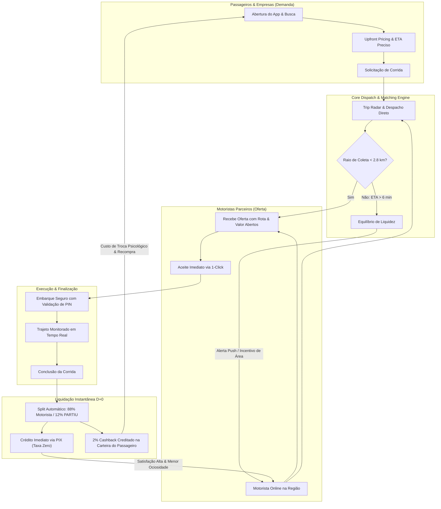
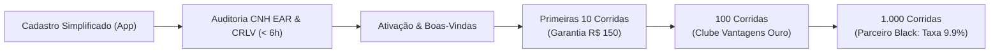
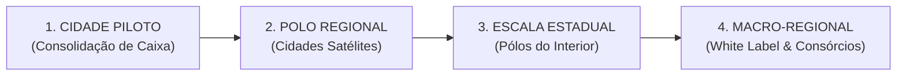
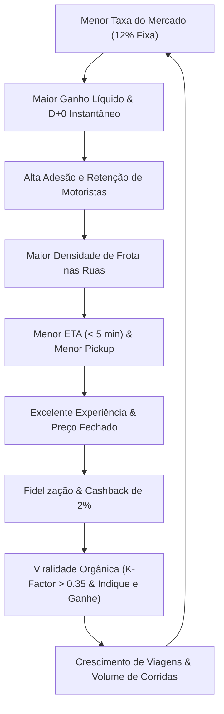

# MANUAL OFICIAL DE OPERAÇÃO COMERCIAL & CRESCIMENTO — PARTIU
### Documento Estratégico de Operações, Marketplace Dynamics, Go-To-Market & FinOps

> **Comitê Executivo de Elaboração:**  
> • Ex-Diretor de Operações da Uber  
> • Ex-Diretor de Expansão da 99  
> • Head of Marketplace Dynamics & Liquidity  
> • Head of Growth & User Acquisition (Driver & Rider)  
> • Head of Trust, Safety & Regulatory Affairs  
> • Chief Operating Officer (COO) & Chief Product Officer (CPO)  
>
> **Vigência:** Planejamento Trienal (2026 — 2029)  
> **Classificação:** Documento Executivo de Diretoria & Liderança de Operações  
> **Status:** 🟢 Documento Homologado para Execução Estratégica  

---

## 🏛️ ETAPA 1 — DEFINIÇÃO DO MODELO OPERACIONAL & MANIFESTO

### 1.1. O que é o PARTIU
O **PARTIU** é uma plataforma tecnológica de mobilidade urbana e entregas rápidas sob demanda que conecta passageiros e remetentes a condutores parceiros autônomos. Nosso modelo operacional é fundamentado na **Justiça Econômica Regional**: máxima remuneração ao condutor com a menor taxa do mercado, combinada a preço transparente e previsível para o usuário final.

### 1.2. O que o PARTIU NÃO É
* **NÃO** é um aplicativo de reservas antecipadas ou passagens rodoviárias.
* **NÃO** é uma cooperativa de transporte público regulado por concessão de linha fixa.
* **NÃO** é um marketplace aberto de barganha leiloeira (estilo InDrive), onde o usuário perde tempo discutindo preço com múltiplos motoristas.
* **NÃO** é uma corporação global opaca que retém até 40% do ganho do trabalhador brasileiro e remete os lucros para paraísos fiscais.

### 1.3. Matriz Competitiva de Posicionamento

| Dimensão de Comparação | UBER | 99 | INDRIVE | PARTIU (Nossa Vantagem Competitiva) |
| :--- | :--- | :--- | :--- | :--- |
| **Taxa da Plataforma (Take-Rate)** | Variável e opaca (25% a 42%) | Variável (20% a 35%) | 10% a 12% | **Fixa e Transparente: 12%** |
| **Repasse ao Motorista** | 58% a 75% | 65% a 80% | ~88% | **88% Líquido Garantido** |
| **Momento do Recebimento** | Semanal ou D+0 c/ taxa de saque | D+0 ou D+1 | Direto em dinheiro/PIX | **Instantâneo D+0 via PIX (Taxa Zero)** |
| **Preço ao Passageiro** | Dinâmico imprevisível (Surge) | Dinâmico frequente | Preço negociado (moroso) | **Preço Fechado Justo (Upfront Pricing)** |
| **Segurança de Embarque** | Opcional | Opcional | Baixa | **PIN 4 Dígitos Obrigatório + Farol Noturno** |
| **Retenção de Riqueza Local** | Evasão internacional | Evasão internacional | Evasão internacional | **100% da riqueza fortalece a economia da cidade** |

### 1.4. O Manifesto Oficial da Plataforma

> *"O trânsito não precisa ser um campo de batalha entre quem dirige e quem viaja.  
> Enquanto as gigantes globais aumentam suas taxas, cobram tarifas abusivas quando chove e deixam o motorista sem dinheiro para abastecer no fim do dia, nós escolhemos outro caminho.  
> O PARTIU nasceu para devolver a dignidade a quem está ao volante e a tranquilidade a quem precisa chegar.  
> Taxa justa de 12%. Dinheiro na conta no mesmo minuto via PIX. Carros vistoriados, PIN de segurança e respeito mútuo.  
> Para trabalhar, para voltar para casa, para viver a sua cidade.  
> Para onde você for: PARTIU!"*

---

## ⚖️ ETAPA 2 — MARKETPLACE DYNAMICS (O MOTOR ECONÔMICO)

O equilíbrio de liquidez entre **Oferta** (Motoristas e Entregadores) e **Demanda** (Passageiros e Empresas) é o coração que dita a sustentabilidade e a escala de uma plataforma de mobilidade.



### 2.1. Tabela de SLAs e KPIs Operacionais Globais

| Métrica Operacional | Meta Operacional (Target) | Limiar de Alerta (Warning) | Ação de Intervenção Imediata |
| :--- | :---: | :---: | :--- |
| **Taxa de Atendimento (Fulfillment Rate)** | **> 88%** | < 75% | Disparar bônus de incentivo de área para condutores no perímetro. |
| **Tempo Estimado de Chegada (ETA)** | **< 6 minutos** | > 9 minutos | Expandir raio de despacho dinâmico e alertar motoristas offline via push. |
| **Distância Máxima de Coleta (Pickup)** | **< 2,8 km** | > 4,0 km | Bloquear despacho ultra-longo que gera frustração e cancelamento. |
| **Taxa de Cancelamento do Passageiro** | **< 6%** | > 12% | Auditar precisão do tempo de chegada exibido no mapa e latência de GPS. |
| **Taxa de Cancelamento do Motorista** | **< 4%** | > 8% | Penalizar condutores com congelamento temporário após 3 recusas seguidas. |
| **Taxa de Aceitação do Trip Radar** | **> 80%** | < 65% | Revisar tarifa mínima da zona ou acionar multiplicador dinâmico regional. |
| **Ganhos Médios por Hora do Motorista** | **R$ 38 a R$ 52/h** | < R$ 28/h | Reduzir aquisição de novos condutores para blindar rentabilidade da frota. |

---

## 🚗 ETAPA 3 — ESTRATÉGIA DE AQUISIÇÃO E RETENÇÃO DE MOTORISTAS

### 3.1. A Jornada Completa do Motorista Parceiro PARTIU



### 3.2. Como Convencer um Motorista da Uber / 99 a Virar PARTIU
#### 💡 A Matemática do Bolso (O Argumento Financeiro Irrefutável):
* Em **R$ 5.000,00 faturados** na Uber ou 99, o motorista deixa entre **R$ 1.250,00 e R$ 1.800,00** retidos na plataforma corporativa.
* No **PARTIU**, a taxa fixa de **12%** retém estritamente **R$ 600,00**.
* **Resultado prático:** São **mais de R$ 1.000,00 de lucro limpo adicional** no bolso da família do motorista todo santo mês.
* **Saque PIX D+0 Sem Custo:** O motorista encerra a corrida às 23h30 e o dinheiro já está disponível na conta corrente/chave PIX para abastecer, jantar ou pagar o aluguel do veículo, sem taxas predatórias de saque rápido (como os R$ 4,50 cobrados na concorrência).
* **Destino e Valor Total Sempre Visíveis:** Transparência total antes do aceite. Fim da insegurança de aceitar viagens no escuro.

### 3.3. O Programa Oficial de Parceiros: Níveis e Gamificação

* 🥉 **Nível Bronze (0 a 49 corridas/mês):**  
  Taxa padrão de 12%, suporte padrão in-app, acesso ao painel de ganhos instantâneos.
* 🥈 **Nível Prata (50 a 149 corridas/mês):**  
  Desconto de R$ 0,15/L em redes conveniadas de combustíveis, suporte prioritário via canal WhatsApp dedicado.
* 🥇 **Nível Ouro (150 a 299 corridas/mês):**  
  Desconto de R$ 0,25/L em gasolina/GNV, 20% de abatimento em troca de óleo e manutenção preventiva, isenção da taxa de cancelamento após tolerância de 4 minutos no pickup.
* 💎 **Nível Black (300+ corridas/mês com avaliação ≥ 4.90):**  
  Taxa promocional exclusiva de **9.9%**, linha direta telefônica de suporte 24h, prioridade máxima no Trip Radar e consultoria contábil MEI gratuita.

---

## 👥 ETAPA 4 — ESTRATÉGIA DE AQUISIÇÃO E RETENÇÃO DE PASSAGEIROS

### 4.1. Funil de Ativação do Passageiro
1. **Passo 1 (Primeira Corrida):**  
   Cupom de Boas-Vindas **`PARTIU10`** (10% OFF ou R$ 7,00 OFF na primeira viagem). Reduz a barreira inicial de experimentação.
2. **Passo 2 (Segunda Corrida — Até 48h):**  
   Disparo automatizado de Push Notification:  
   *“Gostou da sua viagem? Use o cupom PARTIU2 e ganhe R$ 5,00 na volta para casa hoje!”*
3. **Passo 3 (Usuário Recorrente — 3 a 5 corridas/semana):**  
   Ativação compulsória no Clube PARTIU Fidelidade com notificações de saldo acumulado.
4. **Passo 4 (Usuário Embaixador):**  
   Mecanismo *Indique e Ganhe*:  
   *“Indique um amigo: ele ganha R$ 5,00 na 1ª corrida e você recebe R$ 5,00 de crédito na carteira assim que ele viajar.”*

### 4.2. Programa Oficial de Fidelidade: PARTIU Cashback
* A cada corrida finalizada, **2% do valor total da tarifa** retorna automaticamente como saldo na carteira digital do passageiro.
* O saldo é abatido sem burocracia nas próximas corridas.
* Gera um poderoso **custo de troca psicológico (switching cost)**: o passageiro evita abrir aplicativos concorrentes porque sempre possui saldo financeiro retido na carteira do PARTIU.

---

## 🚀 ETAPA 5 — ESTRATÉGIA DE LANÇAMENTO (SEMEADURA & MASSA CRÍTICA)

> [!CAUTION]
> **A Armadilha do Lançamento Amplo:** O erro que quebra 90% dos aplicativos regionais é abrir a cidade inteira simultaneamente. Isso dispersa a frota, eleva o ETA para 20 minutos e frustra os primeiros passageiros, matando o app na primeira semana.

```
       LANÇAMENTO FOCADO EM "HIPER-DENSIDADE GEOGRÁFICA"
┌─────────────────────────────────────────────────────────────┐
│ 1. Selecionar Raio Piloto de 4 km² (Centro Comercial + Bares) │
│ 2. Cadastrar e Homologar 50 Motoristas Exclusivos           │
│ 3. Garantir Ganhos Mínimos aos Condutores nos Primeiros 14d │
│ 4. Ativar 1.000 Passageiros Focados na Mesma Rota Pendular │
│ 5. Expandir para o Segundo Bairro Somente Após ETA < 5 min │
└─────────────────────────────────────────────────────────────┘
```

### Plano de Metas de Lançamento (Piloto)

| Marco Operacional | Alvo de Oferta (Condutores) | Alvo de Demanda (Passageiros) | Estratégia de Ativação Tática |
| :--- | :---: | :---: | :--- |
| **Dia 1 ao 7 (Semeadura)** | 50 Motoristas homologados | 250 Usuários VIP | Abordagem presencial nos 3 maiores postos de combustível da cidade e sindicatos/associações de motoristas. |
| **Dia 8 ao 21 (Massa Crítica)** | 100 Motoristas ativos | 1.000 Passageiros cadastrados | Parcerias táticas com faculdades, polos gastronômicos e hospitais; distribuição de displays físicos com QR Code. |
| **Dia 22 ao 60 (Autossustentação)** | 250 Motoristas ativos | 5.000 Passageiros recorrentes | Ativação do boca a boca orgânico via Indique e Ganhe e campanhas de microinfluenciadores locais com foco em segurança. |

---

## 💰 ETAPA 6 — ESTRATÉGIA DE RECEITA & MAPA DE MONETIZAÇÃO (3 ANOS)

```mermaid
timeline
    title Mapa Trienal de Diversificação de Receitas PARTIU
    section 2026 - Ano 1 : Core Mobility
        Take-Rate 12% Corridas Pop, Moto, Plus, Mulher
        Taxa 12% Partiu Flash (Entregas Expressas)
        Taxas de Cancelamento de Passageiro (R$ 5,00)
    section 2027 - Ano 2 : Expansão B2B & Retail Media
        Partiu Empresas (Painel Corporativo 14% a 16%)
        Retail Media (Banners & Parcerias Locais no App)
        Taxa de Credenciamento no Clube de Vantagens
    section 2028-2029 - Ano 3 : Fintech & Escala
        Partiu Prime (Assinatura R$ 19,90/mês)
        Partiu Conta Digital & Cartão Combustível
        Licenciamento White Label p/ Cidades do Interior
```

### Detalhamento das Fontes de Receita por Maturidade

#### 1. Ano 1 — Monetização Core:
* **Taxa de 12% sobre Corridas Urbanas:** Incidência sobre todas as categorias ativas (Pop, Moto, Plus e Mulher).
* **Taxa de 12% sobre Entregas Expressas (Partiu Flash):** Logística de pequenos pacotes e documentos para comércio de bairro.
* **Taxas de Cancelamento:** Cobrança de R$ 5,00 por não comparecimento do passageiro após 5 minutos de espera (88% repassados ao motorista pelo deslocamento, 12% retidos pela plataforma).

#### 2. Ano 2 — Expansão B2B e Mídia Local:
* **Partiu Empresas:** Portal web corporativo para gestão de deslocamento de funcionários e entregas com fechamento quinzenal em fatura/boleto (Take-rate calibrado entre 14% e 16% pelo serviço de faturamento a prazo).
* **Retail Media & Banners In-App:** Veiculação de anúncios geolocalizados de marcas regionais (redes de fast food, shopping centers, faculdades) na home do passageiro.
* **Mensalidade de Fornecedores do Clube:** Postos de gasolina, oficinas e autopeças pagam taxa de listagem institucional para figurar como recomendados aos condutores.

#### 3. Ano 3 — Fintech, Assinaturas e Franquias Regionais:
* **Partiu Prime:** Assinatura mensal de R$ 19,90 para passageiros de alto volume, garantindo isenção permanente de tarifas dinâmicas e 5% de cashback contínuo.
* **Licenciamento White Label:** Modelo de licenciamento do software operacional PARTIU para operadores locais em cidades menores (30k a 100k habitantes).

---

## 🛡️ ETAPA 7 — CENTRAL DE OPERAÇÕES DE CAMPO & SEGURANÇA

### Matriz de Resolução de Incidentes e Contestações

| Ocorrência / Incidente | Prazo Máximo de Resposta (SLA) | Protocolo de Atuação da Central PARTIU |
| :--- | :---: | :--- |
| **Chamado de Pânico (Botão SOS 190)** | **< 30 segundos** | Disparo de sirene visual e sonora vermelha no painel NOC/Admin; congelamento das coordenadas GPS na tela de plantão; abertura de canal de escuta silenciosa; acionamento imediato da viatura policial mais próxima via CIOSP/190 com placa, modelo e localização vetorial. |
| **Acidente de Trânsito** | **< 15 minutos** | Acionamento de socorro médico SAMU (192); envio de equipe de apoio operacional ao local; acionamento da apólice de seguro de acidentes pessoais de passageiros (APP); bloqueio temporário do veículo até laudo mecânico. |
| **Objeto Esquecido no Veículo** | **< 2 horas** | Abertura de chat intermediado com mascaramento total de números de telefone. Crédito de taxa de deslocamento de R$ 20,00 transferida ao condutor para compensar a devolução presencial do item. |
| **Cobrança Indevida / Disputa de Trajeto** | **< 12 horas** | Auditoria vetorial comparando telemetria percorrida com rota ideal calculada pela API de mapas. Em caso de desvio injustificado do condutor, estorno automático da diferença em PIX para o passageiro. |
| **Comportamento Inadequado / Desrespeito** | **< 4 horas** | Suspensão preventiva imediata do perfil infrator por 48 horas enquanto o comitê de segurança analisa relatos de ambas as partes e gravações de áudio/vídeo da viagem. |

---

## 🗺️ ETAPA 8 — ESTRATÉGIA DE EXPANSÃO TERRITORIAL

A expansão do PARTIU obedece a **Gatilhos Numéricos Rígidos**, prevenindo a queima desordenada de capital de giro:



### Critérios Obrigatórios para Autorizar Lançamento em Nova Praça:
1. **Margem de Contribuição 2 (CM2) Positiva** na praça ativa por pelo menos 3 meses consecutivos.
2. **Fulfillment Rate > 85%** e **ETA médio < 5,5 minutos** sustentados na praça atual.
3. **Payback de CAC < 45 dias** tanto para aquisição de motoristas quanto de passageiros.
4. **Fila de Pré-Cadastro Mínima:** Pelo menos 60 condutores homologados e com documentação aprovada aguardando o acionamento comercial antes de abrir o app para os passageiros locais.

---

## 🔄 ETAPA 9 — O FLYWHEEL OFICIAL DE CRESCIMENTO PARTIU



### Métricas de Loop Viral & Defensibilidade
* **K-Factor Alvo (Indique e Ganhe):** `> 0.35` (cada 100 novos usuários atraem organicamente 35 novos passageiros sem gasto adicional de mídia paga).
* **Net Promoter Score (NPS) Alvo:**
  * **Passageiros:** `> 72` (Zona de Excelência)
  * **Motoristas Parceiros:** `> 68` (Zona de Alta Satisfação)
* *Benchmark de Mercado:* Multinacionais operam com NPS de motoristas inferior a 20 devido à instabilidade do take-rate dinâmico. O respeito econômico ao condutor é o pilar de sustentação e maior barreira de entrada da nossa marca.

---

## 🔮 ETAPA 10 — PARTIU 2030 (A VISÃO DE LONGO PRAZO)

### Horizonte 1 Ano (2026 — 2027): A Força Regional
* Consolidação absoluta na cidade piloto e expansão para 5 cidades satélites metropolitanas.
* Mais de **1.500 condutores e entregadores ativos** faturando diariamente.
* Lançamento oficial do portal corporativo **Partiu Empresas**.

### Horizonte 3 Anos (2027 — 2029): A Referência Estadual
* Liderança isolada de mercado no estado em cidades de médio porte (100k a 800k habitantes).
* Lançamento da **Partiu Conta Digital (Fintech)** com cartão com bandeira própria e linha de microcrédito automotivo pré-aprovado para manutenção preventiva.
* Operação de franquias no modelo White Label para operadores parceiros em estados vizinhos.

### Horizonte 5 Anos (2030): O Ecossistema Urbano Preditivo
* **Despacho Preditivo com Inteligência Artificial:** Algoritmos preditivos que orientam o reposicionamento preventivo da frota 15 minutos antes de eventos esportivos, picos de chuva ou saídas de universidades.
* **Ecossistema Multimodal Integrado:** Conexão contínua entre carros, motos, frete expresso de compras locais em 30 minutos e integração com transporte público coletivo.
* **Consolidação de Marca:** Referência nacional de economia circular, soberania local e dignidade ao trabalhador da mobilidade urbana.
