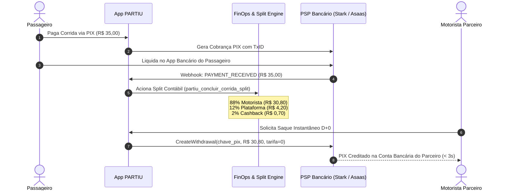

# PIX & PSP INTEGRATION PLAN — PARTIU FINOPS
### Manual de Integração com Instituição de Pagamento (Bacen SPI, Asaas & Stark Bank)

> **Arquivo de Implementação Relacionado:** [`src/lib/partiu-payment-provider.ts`](file:///c:/Users/Suporte/Desktop/PARTIU-%20MOBILIDADE%20URBANA/src/lib/partiu-payment-provider.ts)

---

## 1. O FLUXO DE REPASSE INSTANTÂNEO D+0 (TAXA ZERO)

---

## 2. REQUISITOS DE CONFORMIDADE BANCÁRIA
* **Conta Escrow / Pagamentos:** Todos os valores recebidos dos passageiros transitam em conta gráfica segregada (Conta de Pagamento) vinculada ao CNPJ do PARTIU.
* **Taxa Zero ao Condutor:** A tarifa de liquidação bancária cobrada pelo PSP (média de R$ 0,35 por Pix) é integralmente absorvida pela margem operacional de 12% do PARTIU, nunca repassada ao trabalhador.
* **Segurança de Webhooks:** Assinatura HMAC-SHA256 validada em cabeçalho `X-Webhook-Signature` antes do processamento de qualquer liquidação.
