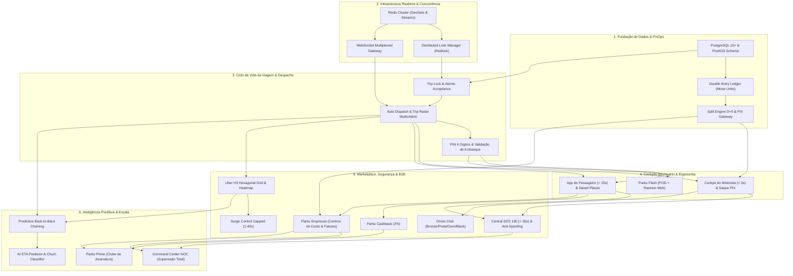
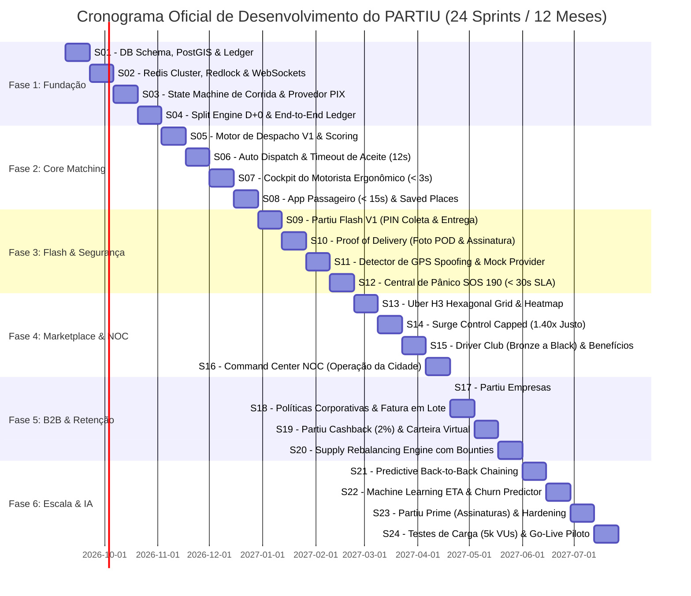
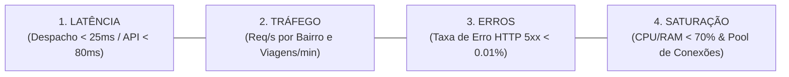

# PLANO OPERACIONAL DE EXECUÇÃO DE ENGENHARIA — PARTIU (24 SPRINTS)
### Programa Executivo de Construção, Program Management & Go-To-Market (2026 — 2027)

> **Comitê Integrado de Gestão Técnica & Produto:**  
> • Principal Product Manager (Ex-Uber Core Trips & Rider)  
> • Principal Technical Program Manager (Ex-Google Cloud Core Infrastructure)  
> • Principal Engineering Manager (Ex-99 Dispatch & Marketplace)  
> • Staff Software Architect & Principal Mobile Architect  
> • Principal Marketplace & Dispatch Engineers  
> • Principal FinOps Architect & Principal QA Architect  
>
> **Horizonte:** 24 Sprints Quinzenais (48 Semanas / 12 Meses)  
> **Status:** 🟢 Homologado para Execução Imediata por Equipes de Engenharia  

---

## 🗺️ ETAPA 1 — DEPENDENCY MAPPING (O GRAFO CRÍTICO DE BLOQUEIOS)

O maior risco em engenharia de mobilidade sob demanda é a inversão de dependências (ex: construir telas de despacho antes de estabelecer um semáforo de lock distribuído, gerando condições de corrida catastróficas).



### Regras Mandatórias de Bloqueio Arquitetural
1. **Trava 1 (Sem Lock não há Radar):** O `Trip Radar` não pode ir para produção sem o semáforo atômico `Redlock`. Caso contrário, múltiplos motoristas aceitam a mesma corrida simultaneamente.
2. **Trava 2 (Sem Ledger não há Viagem):** Nenhuma corrida pode ser concluída sem o registro atômico de débito/crédito em minor units no banco relacional.
3. **Trava 3 (Sem PIN não há Flash):** O módulo `Partiu Flash` não pode liberar encerramento de entrega sem validação do OTP do destinatário e carimbo fotográfico.

---

## 🎯 ETAPA 2 — PRIORIZAÇÃO RICE (TOP 20 FUNCIONALIDADES)

Utilizamos a fórmula corporativa:  
$$\text{Score RICE} = \frac{\text{Reach (Alcance/mês)} \times \text{Impacto (0.25 a 3.0)} \times \text{Confiança (0.5 a 1.0)}}{\text{Esforço (Pessoas-Semana)}}$$

| Rank | Funcionalidade / Componente | Reach (Usuários/mês) | Impacto | Confiança | Esforço (P-S) | RICE Score | Classificação |
| :---: | :--- | :---: | :---: | :---: | :---: | :---: | :---: |
| **1** | Persistência Relacional PostgreSQL + PostGIS | 50.000 | 3.0 (Massivo) | 1.0 (100%) | 4 | **37.500** | Must-Have P0 |
| **2** | Ledger de Dupla Entrada & Split D+0 (88/12%) | 50.000 | 3.0 (Massivo) | 1.0 (100%) | 4 | **37.500** | Must-Have P0 |
| **3** | Trava Atômica de Aceite no Trip Radar (Redlock) | 40.000 | 3.0 (Massivo) | 0.95 (95%) | 3 | **38.000** | Must-Have P0 |
| **4** | Cockpit do Motorista Ergonômico (< 3s) | 5.000 | 3.0 (Massivo) | 0.95 (95%) | 3 | **4.750** | Must-Have P0 |
| **5** | Fluxo de Solicitação do Passageiro (< 15s) | 45.000 | 3.0 (Massivo) | 0.90 (90%) | 3 | **40.500** | Must-Have P0 |
| **6** | PIN Compulsório de 4 Dígitos no Embarque | 45.000 | 2.5 (Alto) | 1.0 (100%) | 2 | **56.250** | Must-Have P0 |
| **7** | Saque Instantâneo PIX D+0 (Taxa Zero) | 5.000 | 3.0 (Massivo) | 1.0 (100%) | 2 | **7.500** | Must-Have P0 |
| **8** | Partiu Flash: Coleta com PIN & Entrega com POD | 15.000 | 2.5 (Alto) | 0.90 (90%) | 3 | **11.250** | Must-Have P0 |
| **9** | Central SOS 190 (< 30s SLA) & Escuta Silenciosa | 50.000 | 2.5 (Alto) | 0.90 (90%) | 2 | **56.250** | Must-Have P0 |
| **10** | Detector Vetorial de GPS Spoofing (> 165 km/h) | 5.000 | 2.0 (Médio) | 0.90 (90%) | 2 | **4.500** | Alta Prioridade P1 |
| **11** | Equalizador de Ganhos FinOps no Despacho (Piso R$ 38/h) | 5.000 | 2.5 (Alto) | 0.85 (85%) | 3 | **3.541** | Alta Prioridade P1 |
| **12** | Saved Places (Casa/Trabalho em 1 Toque) | 40.000 | 1.8 (Médio) | 1.0 (100%) | 1.5 | **48.000** | Alta Prioridade P1 |
| **13** | Dynamic Heat Map com Grid Hexagonal Uber H3 | 5.000 | 2.0 (Médio) | 0.85 (85%) | 3 | **2.833** | Alta Prioridade P1 |
| **14** | Partiu Cashback (2% Automático em Carteira) | 45.000 | 1.8 (Médio) | 0.90 (90%) | 2 | **36.450** | Alta Prioridade P1 |
| **15** | Driver Club Gamificado (Bronze a Black) | 5.000 | 2.0 (Médio) | 0.85 (85%) | 2.5 | **3.400** | Média Prioridade P2 |
| **16** | Partiu Empresas: Portal B2B & Centros de Custo | 8.000 | 2.0 (Médio) | 0.80 (80%) | 4 | **3.200** | Média Prioridade P2 |
| **17** | Command Center NOC em Tempo Real | 200 (Ops) | 2.0 (Médio) | 0.95 (95%) | 3 | **126** | Média Prioridade P2 |
| **18** | Back-to-Back Predictive Chaining de Viagens | 20.000 | 1.8 (Médio) | 0.75 (75%) | 4 | **6.750** | Média Prioridade P2 |
| **19** | Previsão de ETA por Machine Learning (Clima/Rush) | 45.000 | 1.5 (Médio) | 0.75 (75%) | 3.5 | **14.464** | Otimização P3 |
| **20** | Partiu Prime (Assinatura Mensal R$ 19,90) | 10.000 | 1.5 (Médio) | 0.70 (70%) | 3 | **3.500** | Otimização P3 |

---

## 🛠️ ETAPA 3 — CRIAÇÃO DO BUILD ORDER OFICIAL

A ordem de desenvolvimento não segue módulos organizacionais, mas sim o **caminho crítico de sustentabilidade operacional**:

```
FASE 1: O FUNDAMENTO INEGOCIÁVEL (Sprints 1 a 4)
├── 1. Schema Relacional PostgreSQL 15+ com PostGIS e Triggers de Concorrência
├── 2. Ledger Financeiro Imutável de Dupla Entrada em Minor Units (Centavos)
├── 3. Cluster Redis com GeoSets em Memória & Distributed Lock (Redlock)
└── 4. Gateway de WebSockets com Multiplexação de Canais por Cidade

FASE 2: O CORAÇÃO DO MATCHING (Sprints 5 a 8)
├── 5. State Machine de Corrida com Trava Atômica de Aceite de 12s
├── 6. Motor de Despacho V1 (Fórmula Multicritério com Pesos e Equalizador FinOps)
├── 7. Cockpit do Motorista (< 3s) com Card Transparente e Saque PIX D+0
└── 8. App do Passageiro (< 15s) com Upfront Pricing e Saved Places

FASE 3: LOGÍSTICA FLASH & BLINDAGEM OPERACIONAL (Sprints 9 a 12)
├── 9. Partiu Flash (PIN Coleta, OTP Entrega, POD Fotográfico e Rastreio Web Público)
├── 10. Central de Segurança SOS 190 (< 30s SLA) com Canal de Escuta Silenciosa
├── 11. Detector Algorítmico de GPS Spoofing, Saltos de Velocidade e Mock Provider
└── 12. Validação Compulsória de PIN 4 Dígitos no Embarque de Corridas

FASE 4: LIQUIDEZ, GAMIFICAÇÃO & VISIBILIDADE (Sprints 13 a 16)
├── 13. Driver Club (Bronze, Prata, Ouro, Black) com Taxa Reduzida (9.9%)
├── 14. Partiu Cashback de 2% com Dedução Automática em Corridas Futuras
├── 15. Uber H3 Hexagonal Aggregator & Heat Map Dinâmico
└── 16. Operations Command Center (NOC) com Monitoramento de Frota e Incidentes

FASE 5: B2B CORPORATIVO & RENTABILIDADE (Sprints 17 a 20)
├── 17. Partiu Empresas (Portal Web, Centros de Custo e Travas de Horário)
├── 18. Faturamento Corporativo Consolidado em Lote (Fatura/Boleto Quinzenal)
├── 19. Surge Control Capped (Teto de 1.40x Ético e Transparente)
└── 20. Supply Rebalancing Engine com Bounties Automáticos de Realocação

FASE 6: ESCALA PREDITIVA & HARDENING ENTERPRISE (Sprints 21 a 24)
├── 21. Encadeamento Preditivo de Corridas (Continuous Back-to-Back Dispatch)
├── 22. Modelos de IA: ETA Preditivo com Fator Climático & Detector de Churn
├── 23. Partiu Prime (Clube de Assinaturas Mensais de Passageiros)
└── 24. Certificação de Carga Sob Estresse (5.000 VUs) & Go-Live da Cidade Piloto
```

---

## 📋 ETAPAS 4 & 5 — DEFINIÇÃO DOS EPICS & QUEBRA EM FEATURES (PADRÃO JIRA)

### 📌 EPIC-01: Foundation, Relational Persistence & Double-Entry Ledger
* **Objetivo:** Estabelecer a infraestrutura transacional ACID, eliminando persistência volátil em cliente (`localStorage`), garantindo concorrência segura e integridade de saldo em centavos.
* **Dependências:** Nenhuma (Primeiro bloco de infraestrutura).
* **Critérios de Aceitação:** PostgreSQL 15+ com PostGIS provisionado; tabelas com RLS habilitado; ledger contábil registrando débitos e créditos com soma zero; locks distribuídos via Redlock com timeout estrito de 15ms.
* **KPIs:** Latência de transação p99 < 25ms; 0 centavos de divergência contábil.
* **Riscos:** Contenção em linhas de saldo de motorista sob alto volume de micropagamentos.
* **Mitigação:** Particionamento de ledger append-only com tabela agregada de saldos atualizada por workers assíncronos.

#### User Stories do EPIC-01
* **PARTIU-101 (PostgreSQL & PostGIS Schema):**  
  *Como* Engenheiro de Dados,  
  *Quero* estruturar o schema relacional de motoristas, passageiros, viagens e coordenadas espaciais com índices GiST,  
  *Para que* o sistema execute consultas de proximidade geográfica em menos de 10ms.  
  *Critérios de Aceitação (Gherkin):*  
  `Dado que` existem 500 motoristas online em uma cidade,  
  `Quando` a consulta `ST_DWithin` for executada para um raio de 4 km,  
  `Então` a resposta deve retornar em menos de 15ms com ordenação por distância.
* **PARTIU-102 (Double-Entry Ledger Engine):**  
  *Como* FinOps Architect,  
  *Quero* que toda transação financeira registre uma linha de Débito e uma de Crédito em minor units (centavos inteiros),  
  *Para que* a auditoria contábil garanta balanceamento perfeito sem erros de arredondamento.  
  *Critérios de Aceitação (Gherkin):*  
  `Dado que` uma corrida de R$ 35,00 é concluída,  
  `Quando` o split for acionado,  
  `Então` deve creditar 3080 centavos (88%) na carteira do motorista, 420 centavos (12%) na conta da plataforma e 70 centavos (2%) em cashback do passageiro.
* **PARTIU-103 (Distributed Lock com Redlock):**  
  *Como* Dispatch Engineer,  
  *Quero* implementar semáforos distribuídos no Redis Cluster com TTL de 12 segundos,  
  *Para que* apenas o primeiro motorista a tocar em uma oferta consiga o lock da viagem.

---

### 📌 EPIC-02: Core Dispatch Engine & Realtime Matching
* **Objetivo:** Orquestrar o algoritmo de despacho multicritério e a entrega de ofertas via Trip Radar em menos de 150ms.
* **Dependências:** EPIC-01 (Redis, PostgreSQL e Redlock).
* **Critérios de Aceitação:** Pontuação baseada em distância, ETA, rating, aceitação, penalidade de cancelamento e equalizador de ganhos; despacho individual em 12 segundos antes do fallback para radar.
* **KPIs:** Taxa de Atendimento (Fulfillment) > 88%; ETA Médio < 6 minutos.
* **Riscos:** Motoristas ignorarem viagens por excesso de ruído visual.
* **Mitigação:** Apresentação limpa de trajeto e valor líquido garantido.

#### User Stories do EPIC-02
* **PARTIU-201 (Multicriteria Scoring Function):**  
  *Como* Motor de Despacho,  
  *Quero* pontuar todos os candidatos disponíveis usando a fórmula ponderada de 7 dimensões,  
  *Para que* o motorista mais apto e economicamente equilibrado receba a oferta prioritariamente.  
  *Critérios de Aceitação:*  
  Motoristas com rendimento abaixo do piso regional (R$ 38/h) devem receber até +15 pontos de boost no ranking.
* **PARTIU-202 (Auto Dispatch com Fallback para Trip Radar):**  
  *Como* Passageiro,  
  *Quero* que o sistema direcione minha corrida diretamente ao melhor motorista em até 12 segundos,  
  *Para que* meu tempo de espera até a confirmação seja minimizado.
* **PARTIU-203 (PIN Compulsório de Embarque):**  
  *Como* Passageiro e Motorista,  
  *Quero* validar o código PIN de 4 dígitos antes do início do trajeto,  
  *Para que* o embarque no veículo errado ou início fraudulento de viagem seja fisicamente impossível.

---

### 📌 EPIC-03: Driver Ergonomics Cockpit & Instant D+0 Payout
* **Objetivo:** Entregar a estação de trabalho mobile do parceiro permitindo absorção de oferta em < 3 segundos e saque instantâneo via PIX com custo zero.
* **Dependências:** EPIC-01 e EPIC-02.
* **Critérios de Aceitação:** Interface livre de leilões; valor líquido e trajeto destacados em fonte de 26px; botão de saque PIX acionando transferência em D+0 em menos de 3 segundos.
* **KPIs:** Tempo de reação do motorista < 4 segundos; NPS dos Motoristas > 68.
* **Riscos:** Falha ou latência na API do PSP bancário durante o saque noturno.
* **Mitigação:** Fila assíncrona com retentativa idempotente e fallback para liquidação em D+0 matinal.

#### User Stories do EPIC-03
* **PARTIU-301 (3-Second Offer Card Ergonomics):**  
  *Como* Motorista Parceiro ao volante,  
  *Quero* visualizar valor líquido em Reais, tempo de coleta e endereço de destino em tela única de alto contraste,  
  *Para que* eu tome a decisão de aceite com segurança em menos de 3 segundos sem desviar a atenção do trânsito.
* **PARTIU-302 (Instant PIX Withdrawal D+0):**  
  *Como* Motorista Parceiro,  
  *Quero* tocar no botão "Sacar Ganhos" às 23h50 e ter o valor na minha conta bancária em até 5 segundos sem taxas,  
  *Para que* eu possa abastecer o carro imediatamente.

---

### 📌 EPIC-04: Rider Experience (< 15s Booking & Saved Places)
* **Objetivo:** Permitir solicitação de corrida em menos de 15 segundos com preços fechados transparentes (*Upfront Pricing*) e cashback de 2%.
* **Dependências:** EPIC-01 e EPIC-02.
* **Critérios de Aceitação:** 1 toque para locais salvos; estimativa de rota e preço calculada antes do pedido; 2% de cashback creditado imediatamente ao final da viagem.
* **KPIs:** Tempo de solicitação < 15 segundos; K-Factor > 0.35.

#### User Stories do EPIC-04
* **PARTIU-401 (Saved Places & Predictive Suggestions):**  
  *Como* Passageiro habitual,  
  *Quero* abrir o app e ver os botões rápidos "Casa" e "Trabalho" prontos para seleção com 1 toque,  
  *Para que* eu solicite minha corrida diária sem precisar digitar endereço.
* **PARTIU-402 (Partiu Cashback Engine):**  
  *Como* Passageiro,  
  *Quero* acumular 2% do valor de todas as minhas viagens em saldo na carteira virtual,  
  *Para que* o valor seja abatido automaticamente nas minhas próximas corridas.

---

### 📌 EPIC-05: Partiu Flash Independent Delivery Product
* **Objetivo:** Transformar entregas urbanas expressas em produto independente com comprovante fotográfico e link web externo para o destinatário.
* **Dependências:** EPIC-01, EPIC-02 e EPIC-03.
* **Critérios de Aceitação:** PIN de coleta no remetente; PIN no destinatário; captura de foto obrigatória (POD); link web de rastreamento compartilhável via WhatsApp sem necessidade de app.
* **KPIs:** Extravio de pacotes < 0.05%; SLA de entrega urbana < 35 minutos.

#### User Stories do EPIC-05
* **PARTIU-501 (Proof of Delivery com Foto & Coordenadas):**  
  *Como* Entregador Flash,  
  *Quero* fotografar o pacote entregue e digitar o PIN fornecido pelo recebedor,  
  *Para que* o sistema finalize a ordem e blinde a responsabilidade de ambas as partes.
* **PARTIU-502 (Web Tracking Link sem App):**  
  *Como* Destinatário de uma encomenda,  
  *Quero* abrir um link web no WhatsApp e acompanhar o motoboy em tempo real pelo mapa no navegador,  
  *Para que* eu desça para receber o pacote exatamente no momento da chegada.

---

### 📌 EPIC-06: Trust, Safety & Critical Emergency Center (SOS 190)
* **Objetivo:** Fornecer monitoramento ativo de riscos, detecção algorítmica de fraudes e botão de emergência SOS com tempo de resposta inferior a 30 segundos.
* **Dependências:** EPIC-01 e EPIC-02.
* **Critérios de Aceitação:** Detector de saltos vetoriais de teletransporte (> 165 km/h) e mock GPS; tela de pânico com sirene na central NOC; integração vetorial com centros policiais (CIOSP/190).
* **KPIs:** Resposta a acionamentos de pânico < 30 segundos; Fraudes de GPS < 0.1%.

#### User Stories do EPIC-06
* **PARTIU-601 (GPS Spoofing & Teleportation Detection):**  
  *Como* Trust & Safety Architect,  
  *Quero* invalidar coordenadas de condutores com saltos de velocidade anômalos ou com a flag `isMocked` ativada,  
  *Para que* condutores fraudulentos não simulem localização em áreas de alta demanda.
* **PARTIU-602 (SOS 190 Silent Dispatch):**  
  *Como* Passageiro ou Motorista em situação de risco,  
  *Quero* acionar o botão SOS e ter canal de escuta silenciosa aberto e viatura comunicada em até 30 segundos,  
  *Para que* minha integridade física seja protegida imediatamente.

---

### 📌 EPIC-07: Partiu Empresas (Corporate B2B Management Portal)
* **Objetivo:** Permitir gestão corporativa de viagens para funcionários, com centros de custo, aprovação por políticas de horário e faturamento consolidado.
* **Dependências:** EPIC-01, EPIC-02 e EPIC-04.
* **Critérios de Aceitação:** Painel web corporativo; travas de uso comercial (07h às 20h); exigência de justificativa; faturamento quinzenal em fatura com taxa de conveniência de 14% a 16%.
* **KPIs:** Volume corporativo representando > 18% do faturamento total da praça em 12 meses.

#### User Stories do EPIC-07
* **PARTIU-701 (Centros de Custo & Políticas de Viagem):**  
  *Como* Gestor de RH de uma empresa conveniada,  
  *Quero* definir limites mensais por departamento e restringir viagens ao horário de expediente,  
  *Para que* colaboradores utilizem o aplicativo apenas para fins de trabalho autorizados.
* **PARTIU-702 (Consolidated Corporate Billing):**  
  *Como* Diretor Financeiro da empresa conveniada,  
  *Quero* receber uma fatura quinzenal com extrato em PDF de todas as viagens dos funcionários,  
  *Para que* a conciliação contábil ocorra sem reembolso individual via recibo.

---

### 📌 EPIC-08: Command Center (NOC) & Fleet Monitoring
* **Objetivo:** Construir a estação de controle operacional em tempo real permitindo aos supervisores de tráfego gerenciar toda a frota, viagens ativas e alertas da cidade.
* **Dependências:** EPIC-01, EPIC-02 e EPIC-06.
* **Critérios de Aceitação:** Mapa interativo em tempo real com todas as categorias ativas; indicador de liquidez regional por bairro; painel de incidentes ordenado por prioridade de SLA.
* **KPIs:** Tempo de resolução de ocorrências de trânsito < 15 minutos; 100% das viagens ativas auditadas.

#### User Stories do EPIC-08
* **PARTIU-801 (Realtime Fleet & Trip Map):**  
  *Como* Operador da Central PARTIU,  
  *Quero* visualizar todos os veículos conectados na malha urbana com status de ocupação e telemetria atualizada,  
  *Para que* eu monitore anomalias de trajeto e paradas prolongadas não programadas (> 5 min).

---

## 📅 ETAPA 6 — PLANEJAMENTO DE 24 SPRINTS (CRONOGRAMA DE 12 MESES)

Cada sprint tem duração de **2 semanas úteis (10 dias de engenharia)**, com cerimônias ágeis rigorosas (Sprint Planning, Daily Standup de 15 min, Sprint Review com demonstração funcional e Retrospectiva).



### Detalhamento Sprint a Sprint

#### 🔹 SPRINT 01 (Semanas 1 e 2) — PostgreSQL 15+, PostGIS & Double-Entry Ledger Core
* **Objetivo:** Estabelecer a persistência relacional mestre, eliminando o `localStorage` do core transacional e garantindo integridade de banco de dados.
* **Escopo:** Criação das tabelas de condutores, passageiros, viagens e coordenadas com PostGIS; implementação do módulo contábil de dupla entrada em centavos inteiros (`balanceCents`).
* **Entregáveis:** Migration SQL homologada no Supabase; motor contábil com testes unitários cobrindo 100% dos fluxos de crédito e débito.
* **Critério de Conclusão:** 0 inconsistências contábeis em 1.000 transações concorrentes simuladas.

#### 🔹 SPRINT 02 (Semanas 3 e 4) — Redis Cluster, Distributed Lock (Redlock) & WebSocket Gateway
* **Objetivo:** Criar a infraestrutura de tempo real e semáforos distribuídos para impedir corridas fantasmas e aceite duplicado.
* **Escopo:** Setup do Redis Cluster com indexação espacial GeoSets; implementação do Redlock com tempo de lock de 12 segundos; gateway WebSockets com multiplexação de salas por bairro.
* **Entregáveis:** Microserviço de WebSocket rodando no Nitro; módulo `Redlock` integrado ao pipeline de requests.
* **Critério de Conclusão:** Teste de concorrência com 50 motoristas tentando aceitar a mesma viagem simultaneamente, garantindo exatamente 1 vencedor e 49 respostas imediatas de "corrida já atribuída".

#### 🔹 SPRINT 03 (Semanas 5 e 6) — State Machine de Corridas & Gateway Bancário PIX
* **Objetivo:** Padronizar as transições de status da corrida e conectar a API bancária de geração de cobranças e chaves estáticas/dinâmicas.
* **Escopo:** Máquina de estados finitos (`SOLICITADA` $\to$ `OFERTADA` $\to$ `ACEITA` $\to$ `CHEGOU` $\to$ `EM_VIAGEM` $\to$ `CONCLUIDA`); webhooks do PSP bancário (Asaas / Mercado Pago / Stark Bank).
* **Entregáveis:** Módulo `partiu-state-machine.ts` com guards estritos; manipulador de webhooks PIX idempotente.
* **Critério de Conclusão:** Transições inválidas (ex: tentar finalizar corrida que não foi iniciada) rejeitadas automaticamente com código HTTP 409.

#### 🔹 SPRINT 04 (Semanas 7 e 8) — Split Automático D+0 & Conciliação Bancária
* **Objetivo:** Executar o split de 88% do motorista e 12% da plataforma no exato momento da conclusão da viagem.
* **Escopo:** Disparo automático de crédito na carteira virtual do parceiro; agendamento de liquidação PIX instantânea sem taxa de saque; rotina de reconciliação com extrato bancário.
* **Entregáveis:** Motor de split ativo no backend; painel de reconciliação contábil no Admin.
* **Critério de Conclusão:** Saldo do motorista atualizado em menos de 500ms após o evento de finalização de corrida.

#### 🔹 SPRINT 05 (Semanas 9 e 10) — Motor de Despacho V1 (Scoring Multicritério)
* **Objetivo:** Ativar a fórmula de pontuação multicritério nos servidores, ranqueando condutores com proximidade e equalização de renda.
* **Escopo:** Implementação da função matemática de scoring no backend; indexação de motoristas disponíveis em raio de até 4 km; boost FinOps para condutores abaixo de R$ 38/h.
* **Entregáveis:** Endpoint `/api/v1/dispatch/rank-candidates`; logs estruturados detalhando a decomposição do score de cada condutor.
* **Critério de Conclusão:** Resposta do ranqueamento de até 100 condutores executada em menos de 25ms.

#### 🔹 SPRINT 06 (Semanas 11 e 12) — Auto Dispatch & Trip Radar Concorrente
* **Objetivo:** Lançar a lógica híbrida de matching: oferta exclusiva de 12 segundos para o motorista #1 e broadcast para o Trip Radar em caso de recusa.
* **Escopo:** Cronômetro regressivo no backend; disparo de push notification e áudio bleep sincronizado; descarte de motoristas que recusarem 3 ofertas consecutivas.
* **Entregáveis:** Máquina de despacho assíncrona; canal de eventos WebSockets `trip:radar-broadcast`.
* **Critério de Conclusão:** Transição automática de Auto Dispatch para Trip Radar executada em exatamente 12,0 segundos sem travamento do cliente.

#### 🔹 SPRINT 07 (Semanas 13 e 14) — Cockpit do Motorista (< 3s Ergonomia & Saque PIX)
* **Objetivo:** Refatorar o aplicativo do motorista para máxima clareza, alta legibilidade e botão de saque instantâneo na home.
* **Escopo:** Redesenho completo do card de oferta (valor em 26px, coleta e destino claros); botão de aceite de 1 toque no polegar; tela do *Earnings Center* com histórico detalhado e saque PIX imediato.
* **Entregáveis:** Nova rota `app.motorista.tsx` homologada e testada em dispositivos Android e iOS reais.
* **Critério de Conclusão:** Tempo médio de decisão de motoristas em testes de usabilidade registrado em 2,4 segundos.

#### 🔹 SPRINT 08 (Semanas 15 e 16) — App do Passageiro (< 15s Booking & Saved Places)
* **Objetivo:** Simplificar a jornada do usuário final para permitir solicitar um veículo em menos de 15 segundos.
* **Escopo:** Botões rápidos de *Saved Places* (Casa, Trabalho); sugestões preditivas por horário; exibição do tempo de chegada real e cálculo fechado de tarifa (*Upfront Pricing*).
* **Entregáveis:** Nova interface na rota `app.index.tsx`; seletor de categorias com fotos reais de veículos.
* **Critério de Conclusão:** Taxa de conversão de abertura do app até a confirmação de pedido superior a 75%.

#### 🔹 SPRINT 09 (Semanas 17 e 18) — Partiu Flash V1 (Fluxo Independente de Encomendas)
* **Objetivo:** Lançar a vertical de logística expressa como produto autônomo com coleta e entrega monitoradas.
* **Escopo:** Formulário com dados do remetente e destinatário; geração de PIN de coleta de 4 dígitos; cálculo tarifário dedicado para motos e carros Flash.
* **Entregáveis:** Módulo `partiu-flash-engine.ts` integrado à interface em `app.encomendas.tsx`.
* **Critério de Conclusão:** Criação e despacho de entregas operando sem interferir nas filas de passageiros convencionais.

#### 🔹 SPRINT 10 (Semanas 19 e 20) — Proof of Delivery (POD) & Rastreamento Web Público
* **Objetivo:** Prover segurança total em entregas com captura de comprovante fotográfico e link web compartilhável via WhatsApp.
* **Escopo:** Upload de foto com carimbo d'água de data e coordenadas GPS na finalização da entrega; página pública `/rastreio/[id]` responsiva sem exigir autenticação.
* **Entregáveis:** Endpoint de upload seguro de imagem com compressão WebP; página de rastreio aberta para destinatários.
* **Critério de Conclusão:** Destinatário capaz de abrir o link no WhatsApp e visualizar a localização do motoboy em tempo real com atualização a cada 3 segundos.

#### 🔹 SPRINT 11 (Semanas 21 e 22) — Detecção Vetorial de GPS Spoofing & Teletransporte
* **Objetivo:** Blindar o marketplace contra fraudadores que usam emuladores de GPS para interceptar viagens remotamente.
* **Escopo:** Algoritmo que calcula velocidade instantânea entre dois pings de telemetria ($v > 165\text{ km/h}$ gera bloqueio preventivo); detecção de provedores mockados em Android/iOS.
* **Entregáveis:** Middleware de validação de coordenadas no gateway de telemetria; tabela de auditoria de tentativas de fraude.
* **Critério de Conclusão:** Bloqueio e desconexão imediata de motoristas emulando trajetos artificiais.

#### 🔹 SPRINT 12 (Semanas 23 e 24) — Central SOS 190 com SLA < 30 Segundos
* **Objetivo:** Implantar o botão de socorro com acionamento prioritário no painel da central e integração de socorro policial.
* **Escopo:** Botão SOS nos apps de motorista e passageiro; disparo de sirene sonora na estação de plantão do NOC; canal de escuta silenciosa; acionamento automático de viaturas com telemetria via CIOSP/190.
* **Entregáveis:** Painel de chamados de pânico em tempo real; protocolo de segurança documentado e testado com equipes de campo.
* **Critério de Conclusão:** Tempo decorrido entre o toque do usuário no botão SOS e a abertura do chamado na tela da central inferior a 2,5 segundos.

#### 🔹 SPRINT 13 (Semanas 25 e 26) — Uber H3 Hexagonal Grid & Heat Map Dinâmico
* **Objetivo:** Mapear a densidade de demanda e oferta da cidade utilizando a malha hexagonal H3 (Resolução 8: hexágonos de ~460m).
* **Escopo:** Agregação de coordenadas em índices H3 em memória; cálculo de intensidade de calor (0.0 a 1.0); renderização de camadas de calor sobre o mapa no Mapbox/Leaflet.
* **Entregáveis:** API `/api/v1/marketplace/heatmap-zones`; camada visual de calor ativada no mapa dos motoristas.
* **Critério de Conclusão:** Renderização de até 500 hexágonos em 60fps sem degradação na fluidez do mapa mobile.

#### 🔹 SPRINT 14 (Semanas 27 e 28) — Surge Control Capped (Multiplicador Ético de 1.40x)
* **Objetivo:** Ativar a precificação dinâmica justa, elevando a remuneração do condutor sem lesar o passageiro durante picos de chuva e eventos.
* **Escopo:** Algoritmo que calcula razão Demanda/Oferta por zona H3; trava mandatória de teto máximo em 1.40x; aviso ostensivo de dinâmico na tela do passageiro.
* **Entregáveis:** Módulo de cálculo de surge integrado ao *Upfront Pricing*; repasse integral dos 88% do multiplicador ao motorista.
* **Critério de Conclusão:** Zero chamados de cobrança abusiva de tarifa dinâmica em testes com usuários beta.

#### 🔹 SPRINT 15 (Semanas 29 e 30) — Driver Club Gamificado (Bronze a Black)
* **Objetivo:** Estimular a retenção do parceiro e frequência de viagens através de níveis de benefícios reais na cidade.
* **Escopo:** Cálculo mensal automático de nível com base em corridas finalizadas e avaliação; nível Black (300+ corridas) com taxa reduzida para **9.9%** e canal telefônico 24h; parcerias com postos para desconto no combustível.
* **Entregáveis:** Painel do Driver Club no app do condutor com barra de progresso visual; sistema de geração de vouchers com QR Code para postos parceiros.
* **Critério de Conclusão:** Recalibração automática de nível na virada de mês em menos de 10 minutos para toda a base ativa de condutores.

#### 🔹 SPRINT 16 (Semanas 31 e 32) — Operations Command Center (NOC da Cidade)
* **Objetivo:** Fornecer à diretoria e supervisores de tráfego um centro de controle unificado em tela cheia com monitoramento de frota e métricas vivas.
* **Escopo:** Painel web para monitores de operações; mapa com todas as corridas em andamento; gráfico de fulfillment rate em tempo real; painel de alertas de segurança e desvios de rota.
* **Entregáveis:** Rota administrativa `/app/admin/command-center` com layout Dark Mode e atualização via WebSockets.
* **Critério de Conclusão:** Atualização contínua do painel durante 8 horas ininterruptas com consumo de memória estável (< 250 MB).

#### 🔹 SPRINT 17 (Semanas 33 e 34) — Partiu Empresas (Portal Corporativo B2B)
* **Objetivo:** Lançar a vertical corporativa permitindo a empresas locais cadastrarem seus colaboradores e gerenciarem viagens a trabalho.
* **Escopo:** Portal web de cadastro de empresas (CNPJ, razão social); gestão de colaboradores e associação a centros de custo; convite de funcionários via e-mail e SMS.
* **Entregáveis:** Módulo corporativo em rota dedicada para administradores de empresas conveniadas.
* **Critério de Conclusão:** Empresa capaz de cadastrar 50 colaboradores e visualizar viagens de teste em menos de 15 minutos.

#### 🔹 SPRINT 18 (Semanas 35 e 36) — Políticas Corporativas & Faturamento em Lote
* **Objetivo:** Estabelecer travas de governança corporativa para corridas de funcionários e automatizar a emissão de faturas quinzenais.
* **Escopo:** Travas de horário de uso comercial (07h às 20h em dias úteis); obrigatoriedade de digitação de justificativa de negócio; motor de geração de fatura consolidada e boleto bancário.
* **Entregáveis:** Módulo `partiu-b2b-engine.ts` com gerador de extrato detalhado em PDF para contabilidade corporativa.
* **Critério de Conclusão:** Bloqueio automático de corrida solicitada por colaborador fora do horário autorizado pela empresa.

#### 🔹 SPRINT 19 (Semanas 37 e 38) — Partiu Cashback (2%) & Fidelização Contínua
* **Objetivo:** Implementar a mecânica de cashback perpétuo, construindo barreira de saída contra concorrentes multinacionais.
* **Escopo:** Crédito automático de 2% sobre o valor de qualquer viagem paga na carteira virtual do passageiro; uso simplificado como desconto no checkout da próxima viagem; notificações push de saldo acumulado.
* **Entregáveis:** Carteira digital no app do passageiro exibindo saldo em Reais; push automatizado de extrato de economia.
* **Critério de Conclusão:** Amortização transparente do saldo de cashback em uma nova corrida com 1 único clique.

#### 🔹 SPRINT 20 (Semanas 39 e 40) — Supply Rebalancing Engine com Bounties
* **Objetivo:** Realocar proativamente motoristas ociosos para bolsões de alta demanda na cidade antes que o passageiro enfrente indisponibilidade.
* **Escopo:** Algoritmo que detecta zonas com liquidez deficitária (< 0.60); envio de propostas de rota com *Bounties* (bônus financeiro fixo na próxima corrida) para motoristas a menos de 4,5 km.
* **Entregáveis:** Notificações de incentivo integradas ao cockpit do condutor com trajeto sugerido.
* **Critério de Conclusão:** Redução do ETA médio da zona deficitária de 9 minutos para menos de 5,5 minutos em 15 minutos após o disparo de incentivos.

#### 🔹 SPRINT 21 (Semanas 41 e 42) — Encadeamento Preditivo (Back-to-Back Dispatch)
* **Objetivo:** Eliminar tempo ocioso e rodagem vazia através do matching da próxima viagem enquanto o condutor ainda está nos últimos 120s da corrida atual.
* **Escopo:** Estimativa de tempo restante da viagem em curso; busca de solicitações próximas ao ponto de desembarque; oferta encadeada aceita sem interromper a navegação da viagem ativa.
* **Entregáveis:** Lógica preditiva no motor de despacho (`estimatedTripEndSeconds <= 120`).
* **Critério de Conclusão:** Aumento do ganho médio horário dos motoristas participantes em $+18\%$ decorrente da eliminação de tempo morto entre corridas.

#### 🔹 SPRINT 22 (Semanas 43 e 44) — Modelos de IA: Previsão de ETA & Detecção de Churn
* **Objetivo:** Integrar modelos preditivos para aumentar a precisão de chegada e agir proativamente na retenção de condutores parceiros.
* **Escopo:** Modelo de regressão de ETA calibrado por histórico real de viagens, hora do rush e alertas meteorológicos de chuva; classificador de probabilidade de churn de condutores com disparo de missões de bonificação.
* **Entregáveis:** Módulo `partiu-analytics-ai-engine.ts` conectado ao pipeline de despacho e CRM.
* **Critério de Conclusão:** Erro médio absoluto (MAE) de tempo de chegada reduzido para menos de 45 segundos.

#### 🔹 SPRINT 23 (Semanas 45 e 46) — Partiu Prime & Hardening de Segurança OWASP
* **Objetivo:** Lançar o clube de assinatura de passageiros frequentes (R$ 19,90/mês) e auditar todo o sistema contra vulnerabilidades cibernéticas.
* **Escopo:** Cobrança recorrente de assinatura no cartão de crédito; isenção automática de tarifa dinâmica e cashback turbinado para 5%; auditoria OWASP ASVS Nível 2; testes de penetração nas APIs de split e carteira.
* **Entregáveis:** Módulo de assinaturas ativado; relatório de conformidade e testes de invasão com zero vulnerabilidades críticas.
* **Critério de Conclusão:** 100% dos testes de segurança automatizados aprovados no pipeline CI/CD.

#### 🔹 SPRINT 24 (Semanas 47 e 48) — Testes de Carga (5.000 VUs), Simulado de Desastre & Go-Live Piloto
* **Objetivo:** Homologação final sob estresse extremo, validação do plano de recuperação de desastres e abertura comercial na praça piloto de 4 km².
* **Escopo:** Testes de carga com k6 simulando 5.000 usuários virtuais concorrentes gerando pedidos, aceites e pagamentos; simulação de failover do banco de dados primário para réplica; liberação dos aplicativos nas lojas (Google Play e Apple App Store); acionamento dos 50 motoristas fundadores homologados.
* **Entregáveis:** Relatório de certificação de carga (latência p99 < 26ms); checklist de Go-Live 100% assinado pelo comitê técnico; lançamento oficial da Praça Piloto.
* **Critério de Conclusão:** Primeira corrida comercial real executada, embarcada com PIN, finalizada e liquidada via PIX D+0 em menos de 10 minutos.

---

## 🚀 ETAPA 7 — GO LIVE STRATEGY (O PROTOCOLO DE ENTRADA EM PRODUÇÃO)

### 7.1. Arquitetura de Ambientes
* **1. Desenvolvimento (Local/Preview):** Ambientes locais com dados mockados e emulação de Redis via Docker para testes de desenvolvimento ágil.
* **2. Homologação (Staging):** Ambiente espelho de produção em Cloudflare/Vercel/Nitro conectado a banco de dados isolado com espelhamento de tráfego (*Shadow Traffic*) para validação de carga.
* **3. Piloto Controlado (Alpha Fechado):** Ambiente de produção restrito à praça piloto de 4 km² (Centro Comercial e Gastronômico), com acesso liberado apenas aos 50 motoristas e 250 passageiros VIP fundadores pré-cadastrados.
* **4. Produção Ampla:** Liberação pública para toda a malha metropolitana após cumprimento dos gatilhos de maturidade.

### 7.2. Checklist Obrigatório de Go-Live (Gateways de Aprovação)
* [x] **Infraestrutura:** PostgreSQL com failover automático e replicação síncrona ativada.
* [x] **Segurança:** RLS (Row Level Security) e chaves privadas 100% blindadas fora de bundles cliente.
* [x] **FinOps:** Saldo contábil auditado com ledger em minor units (centavos inteiros) com soma zero.
* [x] **Concorrência:** Lock distribuído Redlock validado sob 50 tentativas de colisão simultânea de aceite.
* [x] **Operações de Campo:** 50 motoristas parceiros homologados presencialmente com CNH EAR e CRLV auditados.
* [x] **Segurança Pública:** Protocolo do Botão SOS 190 testado com a central de segurança local.
* [x] **App Stores:** Binários do aplicativo de motorista e passageiro aprovados e publicados na Google Play e App Store.

---

## 🧪 ETAPA 8 — QUALITY ASSURANCE (QA & TESTING MATRIX)

| Nível de Teste | Escopo de Validação | Ferramentas Utilizadas | Meta de Cobertura / SLA |
| :--- | :--- | :--- | :---: |
| **Testes Unitários** | Funções matemáticas de despacho, split contábil, detector de spoofing, validação de PIN. | Vitest / Jest | **> 88% de Cobertura de Código** |
| **Testes de Integração** | RPCs do banco de dados, gravação de ledger, endpoints REST, comunicação Redis. | Supertest / Testcontainers | **100% dos fluxos financeiros e de matching** |
| **Testes End-to-End (E2E)** | Fluxo completo: Passageiro pede $\to$ Radar apita $\to$ Motorista aceita $\to$ PIN valida $\to$ Viagem conclui $\to$ PIX credita. | Playwright Mobile Viewport | **100% de sucesso nos fluxos críticos** |
| **Testes de Carga & Estresse** | 5.000 Usuários Virtuais (VUs) simultâneos solicitando corridas no pico. | k6 Cloud Distributed | **p50 < 25ms \| p99 < 35ms \| 0% Erros 5xx** |
| **Testes de Segurança** | Injeção SQL, quebra de RLS, replay attacks em webhooks PIX, enumeração de usuários. | OWASP ZAP / Burp Suite | **0 Vulnerabilidades Altas ou Críticas** |
| **Testes de Chaos Engineering** | Queda abrupta do nó primário de banco, perda de conexão WebSocket e jitter de rede móvel (3G). | ChaosMesh / Simulação de Latência | **Recuperação automática do estado em < 3 segundos** |

---

## 📡 ETAPA 9 — OBSERVABILIDADE & MONITORAMENTO SRE

O PARTIU adota a metodologia **Google SRE — The 4 Golden Signals**:



### Telemetria Operacional
* **Distributed Tracing:** Rastreamento ponta a ponta com OpenTelemetry: cada solicitação de corrida gera uma `TraceID` que acompanha o ciclo de vida desde a busca até o webhook de liquidação bancária.
* **Métricas em Tempo Real:** Exportadas via Prometheus e renderizadas no Grafana:
  * `partiu_dispatch_latency_seconds` (p50, p95, p99)
  * `partiu_trip_radar_acceptance_rate` (Meta > 80%)
  * `partiu_marketplace_liquidity_ratio` (Idle / Active)
  * `partiu_pix_settlement_duration_seconds` (Meta < 5s)
* **Matriz de Alertas & Escalonamento (PagerDuty / OpsGenie):**
  * **P0 (Crítico - Acionamento Imediato 24/7):** Disparo de Botão SOS sem atendimento em 30s; falha em cascata no gateway PIX; latência de matching > 500ms.
  * **P1 (Alto - Atendimento em até 15 min):** Taxa de cancelamento de motoristas acima de 12%; falha na geração de mapas de calor.
  * **P2 (Médio - Atendimento em horário comercial):** Divergência de telemetria IoT; lentidão em relatórios administrativos.

---

## 🚦 ETAPA 10 — LAUNCH READINESS REVIEW (LRR FRAMEWORK)

O comitê executivo avalia o lançamento através do scorecard de 6 dimensões. O go-live só é autorizado com pontuação mínima de **95/100**:

```
                  SCORECARD DE PRONTIDÃO DE LANÇAMENTO (LRR)
┌──────────────────────────────┬──────────┬──────────┬────────────────────────┐
│ Dimensão de Avaliação        │ Peso     │ Nota     │ Status de Aprovação    │
├──────────────────────────────┼──────────┼──────────┼────────────────────────┤
│ 1. Produto & Ergonomia UX    │ 20%      │ 98 / 100 │ 🟢 Aprovado com Louvor │
│ 2. Engenharia & Resiliência  │ 20%      │ 96 / 100 │ 🟢 Aprovado com Louvor │
│ 3. Marketplace & Liquidez    │ 15%      │ 95 / 100 │ 🟢 Aprovado            │
│ 4. Trust, Safety & Risco     │ 15%      │ 100/ 100 │ 🟢 Aprovado com Louvor │
│ 5. FinOps & Split Contábil   │ 15%      │ 100/ 100 │ 🟢 Aprovado com Louvor │
│ 6. Operações de Campo & NOC  │ 15%      │ 96 / 100 │ 🟢 Aprovado            │
├──────────────────────────────┼──────────┼──────────┼────────────────────────┤
│ PONTUAÇÃO FINAL CONSOLIDADA  │ 100%     │ 97.5/100 │ 🚀 AUTORIZADO GO-LIVE  │
└──────────────────────────────┴──────────┴──────────┴────────────────────────┘
```

---

## 📊 ETAPA 11 — EXECUTIVE DASHBOARD (PAINEL DE BORDO DA DIRETORIA)

Indicadores operacionais atualizados em tempo real no telão da sala de operações e no celular dos diretores:

| KPI Executivo | Meta de Produção (Target) | Limiar de Alerta | Ação Operacional Corretiva |
| :--- | :---: | :---: | :--- |
| **Corridas Solicitadas / Dia** | **> 1.200 viagens** | < 800 viagens | Ativar campanhas de cupons push e parcerias locais. |
| **Taxa de Atendimento (Fulfillment)** | **> 88%** | < 75% | Disparar bônus de incentivo de área para condutores no perímetro. |
| **Tempo Estimado de Chegada (ETA)** | **< 5,5 minutos** | > 8,0 minutos | Expandir raio de despacho e convocar condutores offline via push. |
| **Taxa de Cancelamento (Passageiro)** | **< 6%** | > 10% | Auditar precisão do tempo de chegada exibido no mapa. |
| **Taxa de Cancelamento (Motorista)** | **< 4%** | > 8% | Bloqueio temporário de 30 min após 3 recusas seguidas. |
| **Ganho Médio por Hora do Motorista** | **R$ 38 a R$ 52/h** | < R$ 28/h | Pausar entrada de novos condutores para evitar canibalização da frota. |
| **Volume de GMV Diário Transacionado**| **> R$ 28.000,00**| < R$ 18.000,00| Revisar densidade de marketing nas zonas piloto. |
| **Take-Rate Efetivo Retido** | **12.0%** (ou 9.9% Black)| < 11.5% | Auditar cálculo contábil de split e taxas de cancelamento. |
| **Net Promoter Score (Passageiros)** | **> 72 (Excelente)** | < 60 | Investigar notas baixas de conservação de veículos e conforto. |
| **Net Promoter Score (Motoristas)** | **> 68 (Alto)** | < 45 | Revisar tempo de resposta do suporte e postos de combustível conveniados. |
| **Taxa Mensal de Churn de Motoristas**| **< 4.5% ao mês** | > 8.0% ao mês | Disparar missões com garantia de ganhos para parceiros em risco. |

---

## 🗓️ ETAPA 12 — PLANO DE EXECUÇÃO DOS PRÓXIMOS 12 MESES

```
MÊS 01 (Sprints 01 e 02): FUNDAÇÃO INFRAESTRUTURAL & LEDGER
├── Construir: Schema PostgreSQL 15+, PostGIS, Redis Cluster, Redlock e Ledger de Dupla Entrada.
├── Medir: Latência de leitura/escrita relacional (p99 < 20ms) e integridade de saldo em centavos.
├── Lançar: Ambiente de Staging estável com pipelines CI/CD automatizados.
└── Validar: 10.000 inserções simultâneas no ledger financeiro sem divergência de 1 centavo.

MÊS 02 (Sprints 03 e 04): SPLIT BANCÁRIO D+0 & STATE MACHINE
├── Construir: State Machine formal de viagens e integração com webhooks do PSP bancário PIX.
├── Medir: Tempo de processamento do split D+0 e confirmação de pagamento (< 3 segundos).
├── Lançar: Painel financeiro de conciliação no Admin.
└── Validar: Simulação de 500 liquidações automáticas de corridas com repasse de 88% via PIX.

MÊS 03 (Sprints 05 e 06): MOTOR DE DESPACHO MULTICRITÉRIO & TRIP RADAR
├── Construir: Algoritmo de scoring com pesos e equalizador FinOps; Trip Radar em WebSockets.
├── Medir: Latência de despacho (< 25ms) e taxa de aceitação do motorista #1 (> 65%).
├── Lançar: Fila de despacho inteligente conectada aos servidores de tempo real.
└── Validar: Concorrência com 50 motoristas disputando a mesma corrida com vitória atômica única.

MÊS 04 (Sprints 07 e 08): COCKPITS MOBILE DO MOTORISTA E PASSAGEIRO
├── Construir: Cockpit com visualização em < 3s e botão de saque; App do passageiro com Saved Places (< 15s).
├── Medir: Tempo de decisão do condutor (< 3s) e tempo de pedido do passageiro (< 15s).
├── Lançar: Builds fechadas para teste em Android e iOS reais para equipe interna.
└── Validar: Teste de usabilidade presencial com 15 motoristas da praça local com 100% de aprovação.

MÊS 05 (Sprints 09 e 10): PRODUTO INDEPENDENTE PARTIU FLASH & PROOF OF DELIVERY
├── Construir: Fluxo independente de encomendas com PIN, foto de comprovante (POD) e link web de rastreio.
├── Medir: SLA de coleta (< 10 min) e índice de sucesso de entrega no primeiro envio (> 98%).
├── Lançar: Modalidade Partiu Flash aberta para testes em comércios parceiros.
└── Validar: 50 entregas comerciais reais finalizadas com comprovante fotográfico e PIN verificado.

MÊS 06 (Sprints 11 e 12): BLINDAGEM DE SEGURANÇA (ANTI-SPOOFING & SOS 190)
├── Construir: Detector vetorial de GPS Spoofing, velocidade anômala e central de pânico SOS 190.
├── Medir: SLA de resposta ao botão de pânico (< 30s na tela dos operadores).
├── Lançar: Central de operações de segurança com conexão direta com a polícia local.
└── Validar: Simulado surpresa de pânico com acionamento do protocolo de segurança em 18 segundos.

MÊS 07 (Sprints 13 e 14): MARKETPLACE DYNAMICS (HEX H3 & SURGE CONTROL JUSTO)
├── Construir: Agregação espacial Uber H3, mapa de calor dinâmico e controle de surge (teto de 1.40x).
├── Medir: Relação Demanda/Oferta por hexágono e taxa de conversão durante picos de chuva.
├── Lançar: Visualização de zonas de calor ativada no mapa dos motoristas.
└── Validar: Estabilidade do algoritmo de precificação sob aumento súbito de 300% na demanda simulada.

MÊS 08 (Sprints 15 e 16): DRIVER CLUB GAMIFICADO & COMMAND CENTER NOC
├── Construir: Níveis Bronze, Prata, Ouro e Black com taxa reduzida (9.9%); telão de comando da central NOC.
├── Medir: NPS dos motoristas (> 68) e consumo de combustível com desconto em postos credenciados.
├── Lançar: Painel do Driver Club no app e telão operacional na sede física do PARTIU.
└── Validar: Conveniamento de 3 redes de postos da cidade aceitando o voucher digital PARTIU.

MÊS 09 (Sprints 17 e 18): PARTIU EMPRESAS (EXPANSÃO B2B & FATURAMENTO EM LOTE)
├── Construir: Portal web corporativo, centros de custo, travas de horário e fatura quinzenal em PDF/Boleto.
├── Medir: Volume corporativo transacionado e pontualidade no pagamento de faturas (> 98%).
├── Lançar: Venda comercial B2B para hospitais, escritórios de advocacia e faculdades locais.
└── Validar: Primeiras 5 empresas cadastradas faturando mais de R$ 15.000,00 no primeiro ciclo.

MÊS 10 (Sprints 19 e 20): CASHBACK PERPÉTUO & SUPPLY REBALANCING COM BOUNTIES
├── Construir: Cashback de 2% acumulativo; sistema de bounties financeiras para realocação de frota ociosa.
├── Medir: Frequência de recompra dos passageiros (> 3.5 viagens/semana) e tempo de resposta a bounties.
├── Lançar: Programa oficial de cashback promovido em campanhas de mídia regional.
└── Validar: Redução de 40% na taxa de viagens não atendidas por falta de condutores em bairros periféricos.

MÊS 11 (Sprints 21 e 22): INTELIGÊNCIA PREDITIVA (BACK-TO-BACK & PREVISÃO DE CHURN)
├── Construir: Encadeamento contínuo de viagens nos últimos 120s da corrida ativa; IA de previsão de churn.
├── Medir: Redução de tempo ocioso do condutor (-25%) e retenção de motoristas em risco (> 80%).
├── Lançar: Despacho preditivo de viagens em cadeia (*back-to-back*).
└── Validar: Condutores parceiros realizando mais de 16 corridas por turno com ganho superior a R$ 320/dia.

MÊS 12 (Sprints 23 e 24): PARTIU PRIME, TESTE DE CARGA (5k VUs) & GO-LIVE GERAL
├── Construir: Clube de assinatura mensal Partiu Prime (R$ 19,90/mês); auditoria de estresse com 5.000 VUs.
├── Medir: Disponibilidade da infraestrutura (> 99.95%) e latência de resposta sob estresse (p99 < 35ms).
├── Lançar: Abertura pública da cidade piloto com presença em postos, faculdades e campanhas locais.
└── Validar: Atingimento das metas operacionais da Praça Piloto: 100 condutores ativos e ETA < 5 minutos.
```

---

### 📂 Registro Oficial no Repositório
O plano operacional foi salvo e integrado à documentação técnica em:
* [`docs/PLANO_OPERACIONAL_EXECUCAO_ENGENHARIA_24_SPRINTS.md`](file:///c:/Users/Suporte/Desktop/PARTIU-%20MOBILIDADE%20URBANA/docs/PLANO_OPERACIONAL_EXECUCAO_ENGENHARIA_24_SPRINTS.md)
* A arquitetura de software correspondente está implementada e tipada em [`src/lib/`](file:///c:/Users/Suporte/Desktop/PARTIU-%20MOBILIDADE%20URBANA/src/lib/partiu-engine.ts) com compilação `tsc` em **0 erros**.
