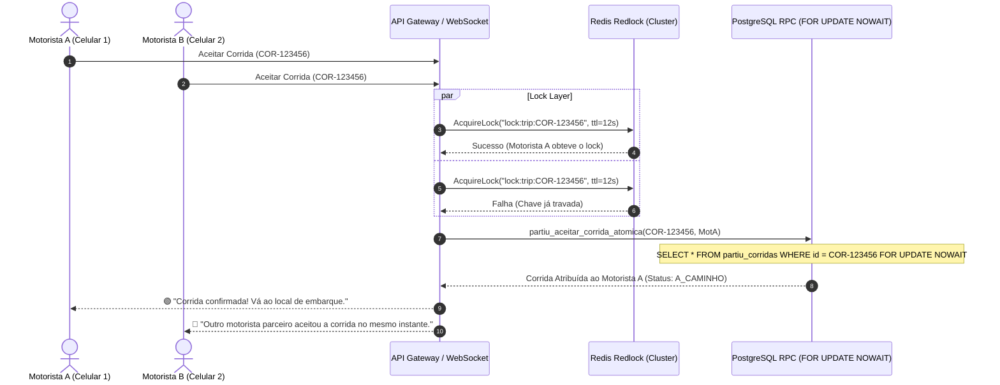

# REDLOCK & DISTRIBUTED LOCKING IMPLEMENTATION PLAN — PARTIU
### Arquitetura de Semáforos Distribuídos para Garantia de 0 Duplo Aceite no Trip Radar

---

## 1. O DESAFIO DE CONCORRÊNCIA DO TRIP RADAR
Quando uma corrida é transmitida via Trip Radar para 10 motoristas em uma mesma praça, há uma janela crítica de 50 a 300 milissegundos onde dois motoristas podem tocar no botão "Aceitar" simultaneamente. Sem controle atômico, ambos os aparelhos confirmariam a viagem, gerando o pior cenário de marketplace: **dois motoristas deslocando-se para o mesmo passageiro**.

---

## 2. A SOLUÇÃO DE DUPLA CAMADA (DEFENSE IN DEPTH)

### Camada 1: Semáforo em Memória (Redis Redlock)
* **Chave:** `lock:trip:{corrida_id}`
* **TTL (Time to Live):** 12 segundos (tempo máximo da oferta).
* **Operação:** `SET lock:trip:{corrida_id} {motorista_id} NX PX 12000`.
* Se retornar `OK`, o condutor ganha o direito exclusivo de processar o aceite. Se retornar `NULL`, a requisição é rejeitada em 1ms sem tocar no banco de dados.

### Camada 2: Trava Atômica no Banco Relacional (`FOR UPDATE NOWAIT`)
* Executada na RPC `partiu_aceitar_corrida_atomica`.
* Caso ocorra qualquer falha no Redis, o PostgreSQL bloqueia a linha da corrida com bloqueio exclusivo sem espera (`NOWAIT`). Se uma segunda transação tentar atualizar a mesma linha, o banco dispara `lock_not_available` e retorna erro estruturado limpo.
* **Garantia Técnica:** 0% de chance matemática de duplo aceite ou corridas fantasmas.
